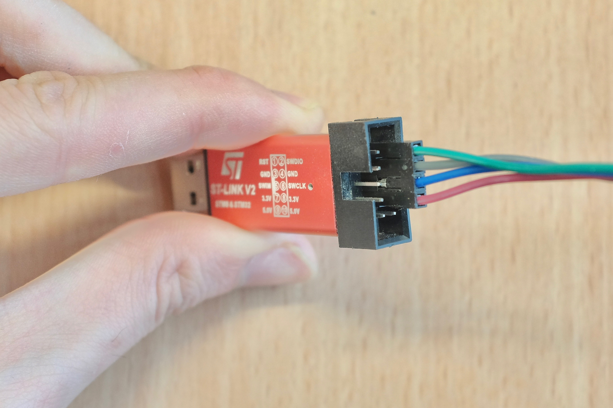
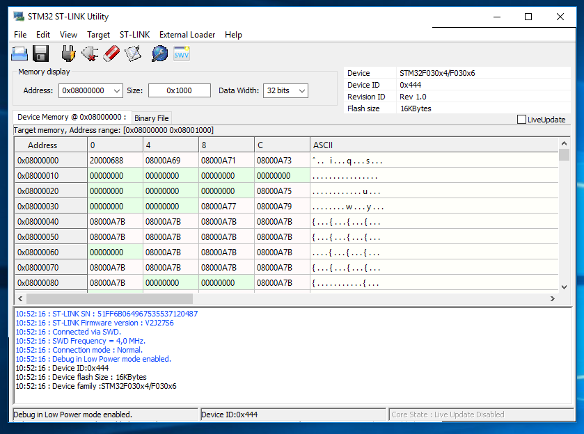

# Lesson 000: Board Detail, Softwares, and Blinking LED

Previous lesson: [Introduction and required hardwares](../README.md)

In this lesson we're going to take a detailed look at the chip and the dev board, learn how to hook it up to the programmer, install required softwares, set up the microcontroller, and finally write our very own "Blink" program!

This is the most important lesson of them all since it walks you through the entire process in detail.

## The chip

We will be using the **STM32F030F4P6** chip throughout this tutorial series. Out of the hundreds of STM32 variants, this is actually the cheapest and most basic chip available. And here is its specs:

Now it might sound counterintuitive to start from the bottom of the line, but I do have some very good reasons:

* They are cheap. A single chip is 50 cents, and a compete dev board is only $1.5.

* They are simple enough for first timers to get going quickly. 

* Despite the lowly status, they are still very capable and contain all the basic peripherals we're going to cover.

* All you learned working with this chip also applies to all other STM32 chips, so you can easily step up after you're done.

Now let's take a look at the pinout of this chip, taken from [the datasheet](../resources/datasheets/stm32f030f4p6.pdf):

Unlike Arduino where pins are referred to by simply a number(pin 1, pin 2...), GPIO pins on bare microcontrollers like STM32 usually has a *port* and *number* associated with them. A *port* is a set of pins that are organized internally and can be controlled together. In STM32, GPIO ports are named alphabetically starting from A, and each port can have up to 16 pins from 0 to 15.

As a result, GPIO pins on STM32 are named like `PXY`, which stand for 'Port X pin Y'. Due to size limits not all chips will have all the ports, and not every port will have all its 16 pins. In this case, most of the pins are from port A(PA0 to PA14). Port B only has 1 pin(PB1), and Port F has 2(PF0 and PF1).

There are also some non-GPIO pins common to all STM32 chips that are worth mentioning:

| Pin name | Function                                             |
|----------|------------------------------------------------------|
| VSS      | Ground                                               |
| VDD      | 3.3V Supply                                          |
| VDDA     | Analog supply for ADC and DAC. Usually equal to VDD. |
| VBAT     | Battery input for RTC and low-power backups	      |
| NRST     | Active low reset. Pulled up internally.              |
| Boot0    | Boot mode. Low: normal startup, High: run bootloader |

That pretty much covers all you need to know for the moment. Let's move on to the dev board.

## The dev board

By now you should have all three pieces of hardwares ready: the dev board itself, the ST-Link v2 programmer, and the USB serial adapter:

Let's take a closer look at the dev board itself with added annotations:

All in all a clean, simple, and versatile little board. Something to note:

* All pins have been broken out on the header.

* The micro USB connector is for power only, since this chip doesn't have USB capability.

* All STM32 chips run at 3.3V, but are 5V tolerant on *digital* pins.

* Don't worry about the BOOT0 selector, leave it on the default GND side. (aka normal startup)

## Hookup

Now let's hook it up to the programmer so we can upload our programs into it. Plug the 4 wires into `SWDIO`, `GND`, `SWCLK` and `3.3V` pins on the programmer:

And connect the other end accordingly into the programming header on the dev board.

That's it! Hope that wasn't too hard for you. The programmer also powers the board when it's plugged in.

## Softwares

We're doing the development under Windows, as it is the easiest way to get started. Of course you can set up your own toolchain in Linux, but that is going to be later.

There are 3 softwares that you need to install, all of which free:

### STM32 ST-LINK utility

A useful utility through which you can view/wipe the flash memory, dump/upload firmwares, adjust chip settings, etc. It also contains the driver for the ST-Link programmer that you just bought.

Go to the official site:

http://www.st.com/en/development-tools/stsw-link004.html

Click the blue "get software" button at the bottom of the page:

It will then ask for your name and email. Give it some fake name and [generate a fake email](https://www.guerrillamail.com) to get the download link.

Run the installer, it will ask you to install the driver, click install.

After it's done, plug in the programmer with the board into a USB port:

If your wiring is correct, the power LED should light up. The user LED might start blinking as well if the seller burned a demo into it, which is kind of a spoiler, but let's ignore that for now.

Windows should install some drivers automatically, wait for it to finish. Then open up the STM32 ST-LINK utility you just installed, click the connect button. 

If the hookup is still correct, the memory content should now appear in the main window:

If everything works, congrats! You can move on to the next software now. There are also some tools in the `Target` menu to play with should you feel adventurous.

### STM32CubeMX

STM32CubeMX is an interactive configuration tool and code generator. It lets you set up the microcontroller in a straightforward graphical interface, then generates the initialization code so you don't have to write any. Pretty neat!

Just like the first one, go to the official link below, click the blue "Get Software" button near the bottom, and download it:

http://www.st.com/en/development-tools/stm32cubemx.html

Inside the zip there are 3 copies for different platforms. You'll want to run the windows one:

If you don't have Java it will ask you to install it. After it's all said and done, we can move on to the third and final software.

### Keil MDK-ARM

This is one of the 