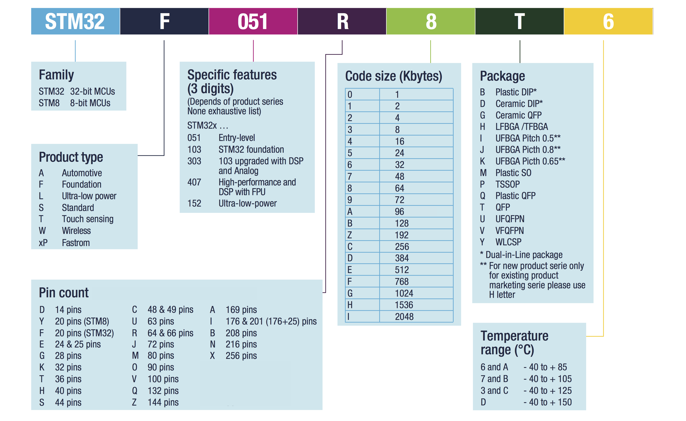
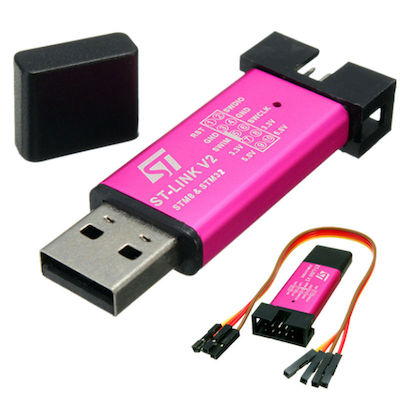
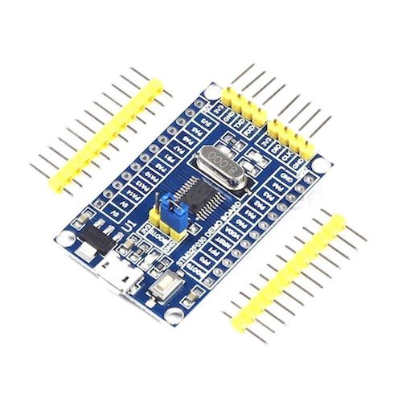

# STM32, The Easy Way

Do you already have some experience with Arduino, and want to step up the game into proper ARM embedded system developments? If so, you're in the right place!

We're going to take a look how to get started with STM32 microcontrollers using the free STM32Cube and Keil MDK-ARM IDE. And to further lower the entry barrier, only $4 worth of hardwares is needed.

This tutorial is designed to be detailed and easy to follow. However, it is **NOT** meant to be a comprehensive guide. Instead it aims to cover the basics to get you going quickly, and provide you with knowledge on finding solution for unknown problems on your own before letting you loose.

In this introductory lesson I will give a brief description about STM32 and what you need for this tutorial, and we'll start coding properly from next lesson.

## The case of Arduino

Now there are many good reasons to stay inside the Arduino ecosystem. After all, it kickstarted the "maker" revolution in the first place. The consistent hardware, simple IDE, and the excellent community support meant it's easier than ever for people to start creating what they want, and the abstraction layer shielded them from the low-level nitty-gritties like peripheral configuration and fuse settings.

It's all well and good, and most people are perfectly content with that. However, when you look at the actual chip on most Arduinos, you'll find an aging ATmega328P, a decade old 8-bit chip with a tiny amount of RAM, limited peripherals, and a leisurely clock speed. As a result, in commercial situations 8-bitters like those have been mostly relegated to cost-sensitive applications like cheap toys. And the world has largely moved on to 32-bit microcontrollers.

Now I'm not saying 8-bit Arduinos have gone completely pointless, in fact they are excellent learning tools and more than adequate for most hobby projects. It's just **if you want to go further down the path of embedded development, plain old Arduino just simply isn't going to cut it.**

## Why 32-bit?

There are a huge number of 32-bit microcontrollers on the market today, most of which use ARM Cortex-M architecture. ARM licenses it out to interested companies, on which they add their own special features and peripherals. This eliminates the cost of designing their own architectures from scratch, and is one of the reasons why ARM is so prevalent in mobile computing today.

Popular examples include STMicroelectronics' STM32 line, NXP's LPC line, and Atmel's own SAM line. I'm using STM32 in this guide because of its relative large community, nice graphical configuration tool, low-cost of dev-board, and abundance of documentations.

STM32s are also widely used in real world customer electronics, examples include [Amazon Dash Button](https://learn.adafruit.com/dash-hacking-bare-metal-stm32-programming/overview), [3D printer drivers](http://www.st.com/en/evaluation-tools/steval-3dp001v1.html), [Apple Watch](http://blog.atollic.com/is-the-apple-watch-developed-using-atollic-truestudio), [Fitbit](http://www.techinsights.com/about-techinsights/overview/blog/fitbit-charge-2-teardown/), [BB-8 robot](https://www.cnet.com/news/sphero-bb-8-teardown-reveals-the-cool-robot-tech-inside-this-fun-star-wars-toy/), [Nintendo Switch](http://www.st.com/content/st_com/en/about/media-center/press-item.html/t3934.html) has 3 of them!.

Those 32-bit chips tends to run faster, have great deal of more memory and peripherals, and even cheaper than the comparable 8-bit chips. To demonstrate, here is a comparison between Arduino and my go-to STM32 chip, STM32F072C8T6:


The result speaks for itself even for a low-end STM32 chip. Here's a brief summary:

### Advantages:

#### High performance 

Even the cost-oriented F0 series beats the Arduino in terms of power and peripherals. As a result, you'll be able to develop larger and more sophisticated programs, with better performance and more connectivity options. RTOS is also no longer a pipe dream like it is on Arduinos.

#### Full debugging support

Hardware debugging is supported on all STM32 chips, that means you have single stepping, breakpoints, memory viewer, all the usual stuff. No need to rely on ```println()``` like on Arduino anymore.

#### Versatile, Reusable and Future-proof:

There are **hundreds** of STM32 variants to choose from. You can go from 50 cents STM32F0 up to 400MHz STM32H7. All of them uses the same tool and code structure so it's trivially easy to port between them. They also mostly have the same pinout for a given package type, so you can simply drop in a more powerful chip without changing the circuit design should the need arises.

#### Integrated Bootloader

All STM32s have built-in bootloader for uploading firmware without using a programmer. This can be done through Serial, USB or even I2C, SPI and CAN bus, all without taking up user flash memory like Arduino does.

#### 5V tolerant

All digital pins are 5V tolerant, so you can safely hook them up to legacy systems.

#### Cost effective

If you're designing a product and making own circuit board, using a STM32 chip is much cheaper, compact, and clean than plopping a whole Arduino on it, especially if you're doing a production run.

### Disadvantages:

Of course there are reasons that STM32 isn't as popular as Arduinos in the makers crowd, and to name a few:

#### Learning curve

Programming on STM32 is a bit more involved than Arduino, but you do get much more control over peripherals as a result. Also, there aren't many guides that give a concise and clear instruction on *just how to get started*. I hope this one changes that.

#### Board choices

You'll want to get a dev board, and there simply aren't many around. ST makes a few themselves, and there are some cheap ones on eBay. We'll touch on this later.

#### Community and library support

It's obvious that STM32's community isn't as vibrant as Arduino's, and as a result there aren't as many ready-to-use libraries available. I hope this guide will help with the situation, and we'll take a look at writing your own libraries and converting existing Arduino libraries as well.

### Conclusion

32-bit microcontrollers like STM32 is much powerful and versatile than 8-bit chips, and is where the industry currently heading towards. It is the logical next step if you want to go beyond the limitation of Arduino.

## STM32 naming schemes

Each STM32 chip has a rather long name like `STM32F042K6T6`. However it's well structured, and here is the official naming convention: 



By looking at the 2 characters just after ```STM32```, you can also tell what ARM processor core a chip is using:

| STM32 Series |   ARM Core   |
|--------------|--------------|
| F7, H7       | Cortex-M7F   |
| F4, F3, L4   | Cortex-M4F   |
| F2, F1, L1   | Cortex-M3    |
| L0           | Cortex-M0+   |
| F0           | Cortex-M0    |

Note how you can eyeball the capability by just looking at the feature numbers. Generally speaking, the higher the number, the better the performance and the variety of peripherals, but also more expensive.

[Click here](resources/datasheets/STM32_product_selection_guide.pdf) for a spec sheet for all STM32 chips.

## What you need

Now let's take a look at what you actually need to get started on STM32 development. Turns out, it's surprising little:

### ST-Link v2 Programmer

You need one to upload programs into the STM32 chip. Fortunately they are all over ebay and dirt cheap (usually less than $3 including shipping). Just search [ST Link v2 on ebay](https://www.ebay.com/sch/i.html?_from=R40&_nkw=st+link+v2) and it should look like this:



### STM32F030F4P6 development board

This is the board we'll be using throughout this tutorial. You can find it by [searching "STM32F030F4P6"](https://www.ebay.com/sch/i.html?_from=R40&_nkw=stm32f030f4p6). They are even cheaper at less than 2 dollars, and should look like this:



We'll get into details about this board in the next lesson.

### USB Serial adapter

You probably already have one if you have been playing with Arduinos. If you don't, go on ebay and search [CP2102](https://www.ebay.com/sch/i.html?_from=R40&_nkw=cp2102). Of course other serial chips like CH340 or FTDI works too, it's just a matter of personal preference.

## Next steps

That's pretty much it for the introduction! For now you should have an understanding about the advantages of 32-bit microprocessors, and ordered the required hardwares from ebay. They usually take 1 or 2 weeks to arrive, although you can pay more for faster shipping. 

You only need 1 programmer, 1 board, and 1 USB serial adaptor to get started, although I do recommend getting 2 of each so you have spares. And even then it would cost less than 10 dollars.

We'll take a look at the details of the dev board, the softwares you need, how to hook everything up, and write your own blink program in the next lesson.

[CLICK ME TO GO TO NEXT LESSON](000_intro_blinkLED/README.md)


