# Lesson 0: A Complete Walkthrough of Board Detail, Software Setup, and Blinking LED.

[Landing Page: Intro and Required Hardwares](../README.md)

**`THIS LESSON`** Lesson 0: Setup and Blinking LED

[Lesson 1: UART and Hello World](../lesson1_serial_helloworld/README.md)

[Lesson 2: External GPIO Interrupts](../lesson2_external_interrupt/README.md)

[Lesson 3: UART Receive and External Files](../lesson3_serial_recv_interrupt)

[Lesson 4: Timers and PWM](../lesson4_timers_and_pwm/README.md)

## Introduction

In this lesson we're going to take a detailed look at the chip and the dev board, learn how to hook it up to the programmer, install required softwares, set up the microcontroller, and finally write our very own "Blink" program!

That's quite a bit of work, and it's going to take a while. However, this is the most important lesson of them all since it walks you through the entire process in detail. Once you persevere, you can use it on any other STM32 variant you want.

## The Chip

We will be using the **STM32F030F4P6** throughout this tutorial series. Out of the hundreds of STM32 variants, this is actually the cheapest and most basic chip available. And here is its specs:


Now it might sound counterintuitive to start from the bottom of the line, but I do have some very good reasons:

* They are cheap. A single chip is 50 cents, and a compete dev board is only $1.5.

* They are simple enough for first timers to get going quickly. 

* Despite the lowly status, they are still very capable and contain all the basic peripherals we're going to cover.

* All you learned working with this chip also applies to all other STM32 chips, so you can easily step up after you're done.


Now let's take a look at the pinout of this chip, taken from [the datasheet](../resources/datasheets/stm32f030f4p6.pdf):

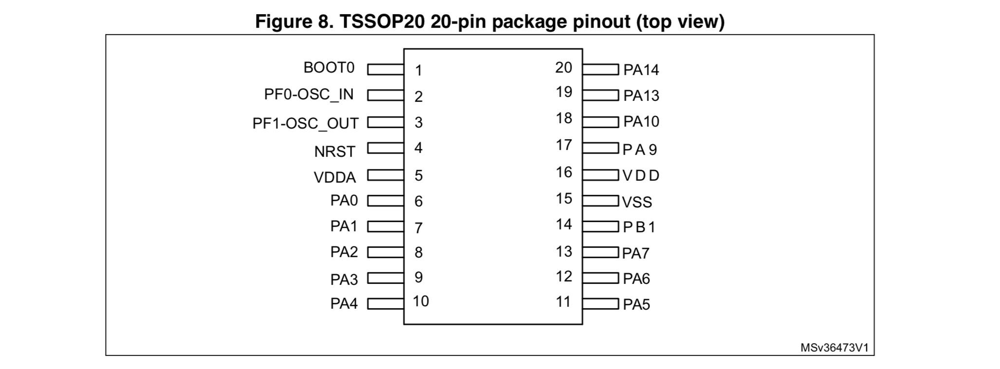

Unlike Arduino where pins are referred to by simply a number(pin 1, pin 2...), GPIO pins on bare microcontrollers like STM32 usually has a *port* and *number* associated with them. A *port* is a set of pins that are organized internally and can be controlled together. In STM32, GPIO ports are named alphabetically starting from A, and each port can have up to 16 pins from 0 to 15.

As a result, GPIO pins on STM32 are named like `PXY`, which stand for 'Port X Pin Y'. Due to size limits not all chips will have all the ports, and not every port will have all its 16 pins. In this case, most of the pins are from port A(PA0 to PA14). Port B only has 1 pin(PB1), and Port F has 2(PF0 and PF1).

There are also some non-GPIO pins common to all STM32 chips that are worth mentioning:

| Pin name | Function                                             |
|----------|------------------------------------------------------|
| VSS      | Ground                                               |
| VDD      | 3.3V Supply                                          |
| VDDA     | Analog supply for ADC and DAC. Usually equal to VDD. |
| VBAT     | Battery input for RTC and low-power backups	      |
| NRST     | Active low reset. Pulled up internally.              |
| BOOT0    | Boot mode. Low: normal startup, High: run bootloader |

That pretty much covers all you need to know for the moment. Let's move on to the dev board.

## The Dev Board

By now you should have all three pieces of hardwares ready: the dev board itself, the ST-Link v2 programmer, and the USB serial adapter:


Let's take a closer look at the dev board itself with added annotations:


All in all a clean, simple, and versatile little board. Something to note:

* All pins have been broken out on the header.

* The micro USB connector is for power only, since this chip doesn't have USB capability.

* All STM32 chips run at 3.3V, but are 5V tolerant on *digital* pins.

* Don't worry about the BOOT0 selector, leave it on the default GND side. (aka normal startup)

## Hookup

Now let's hook it up to the programmer so we can upload our programs into it. We're using ST's SWD debugging interface, which only require 2 wires plus power.

Plug the 4 wires into `SWDIO`, `GND`, `SWCLK` and `3.3V` pins on the programmer:


And plug the other end accordingly into the programming header on the dev board.


That's it! Hope that wasn't too hard for you. The programmer also powers the board when it's plugged in.

## Softwares

We're doing the development under Windows, as it is the easiest way to get started. Of course you can set up your own toolchain in Linux, but that is going to be later.

There are 3 softwares that you need to install, all of which free:

### STM32 ST-LINK utility

A useful utility through which you can view/wipe the flash memory, dump/upload firmwares, adjust chip settings, etc. It also contains the driver for the ST-Link programmer that you just bought.

Go to the official site:

http://www.st.com/en/development-tools/stsw-link004.html

Click the blue "get software" button at the bottom of the page:


It will then ask for your name and email. Give it some fake name and [generate a fake email](https://www.guerrillamail.com) to get the download link.

Run the installer, it will ask you to install the driver, click install.


After it's done, plug in the programmer with the board into a USB port:


If your wiring is correct, the power LED should light up. The user LED might start blinking too if the seller burned a demo program into it, which is kind of a spoiler, but let's ignore that for now.

Windows should install some drivers automatically, wait for it to finish. Then open up the STM32 ST-LINK utility you just installed, click the connect button. 

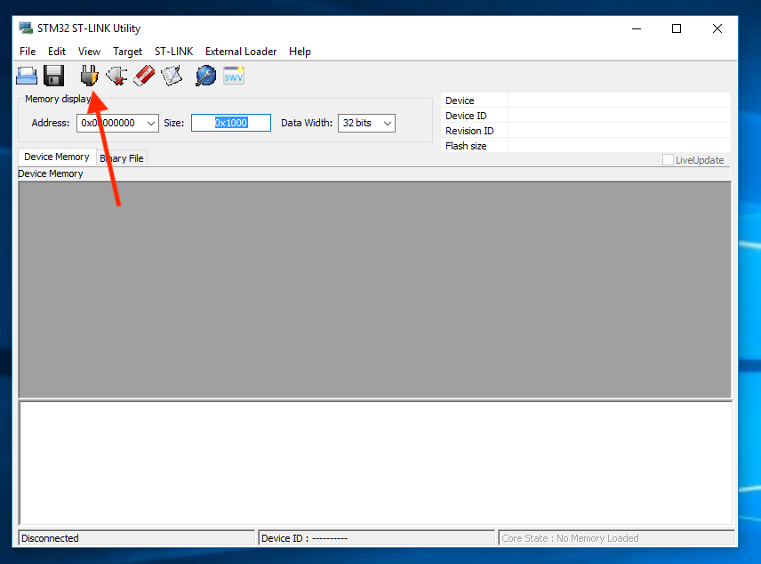

If the hookup is still correct, the memory content should now appear in the main window:


If everything works, congrats! You can move on to the next software now. There are also some tools in the `Target` menu to play with should you feel adventurous.

### STM32CubeMX

STM32CubeMX is an interactive configuration tool and code generator. It lets you set up the microcontroller in a straightforward graphical interface, then generates the initialization code so you don't have to write any. Pretty neat!

Just like the first one, go to the official link below, click the blue "Get Software" button near the bottom, and download it:

http://www.st.com/en/development-tools/stm32cubemx.html

Inside the zip there are 3 copies for different platforms. You'll want to run the windows one:


Click through with defaults. If you don't have Java it will ask you to install it. After it's all said and done, we can move on to the third and final software.

### Keil MDK-ARM

Keil is considered one of the "standard" IDEs in embedded development, it has a large community, and offers excellent compiler and debugging tools. And as you would expect, it is non-free. A license costs thousands of dollars, and a 32KB code size limit is enforced otherwise.

There is a silver lining however, as ST provides a **free license for all STM32F0 parts** with no code size limit at all. The aim is to get more people into STM32, and I guess it's working.

Anyway, F0 is more than capable for the majority of projects, you can it have up to 100 pins, 256KB flash, and 32KB of RAM. And when you do grow out of the F0 series, you can set up the open source arm-gcc compiler and get rid of the license issue all together.

Go to the offcial link below, fill in the form and download the installer. Again, use a [fake identity](http://www.fakenamegenerator.com/) to protect your privacy:

https://www.keil.com/demo/eval/arm.htm

Click through the installer with default settings. It will take a bit and install some drivers. After the installation is finished it will automatically open the "Pack Installer" and start to download some software packages. Just wait for it to finish, you can see the progress on the bottom right corner.

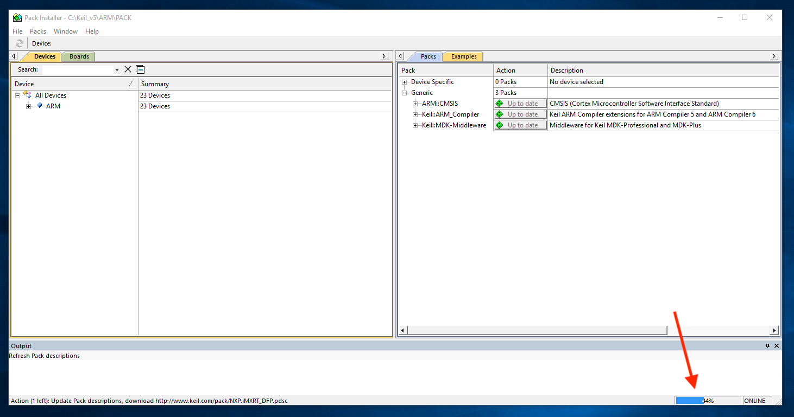

The lists will fill up after it's done. We can quit the program for now.


That's it! All three program installed. We're ready to actually start writing our first STM32 program now!

## The Blinky LED

The simple blinking LED is the "hello world" of embedded systems. It's probably your first Arduino program, and we're going to do it all over again with STM32. The process involves configuring the chip in STM32CubeMX, generating the initialization code, writing your own code, and compile then upload. This process is the same with any STM32 chips.

### Chip Configuration in STM32CubeMX

#### Selecting Target Chip

Open up STM32CubeMX and click `New Project`:


It might start to check for updates, eventually you'll end up here:

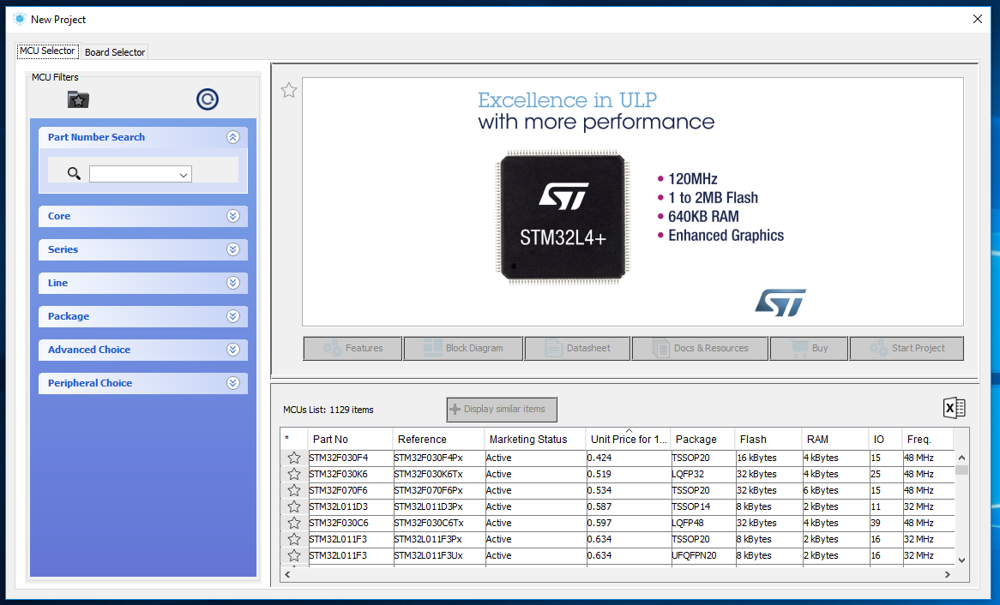

As you can see it's quite a comprehensive list, and you can browse by series, package, features, cost, etc.

We need to find which chip we're using, and since we already know the part number `STM32f030F4`, we just need to type it in the search box:

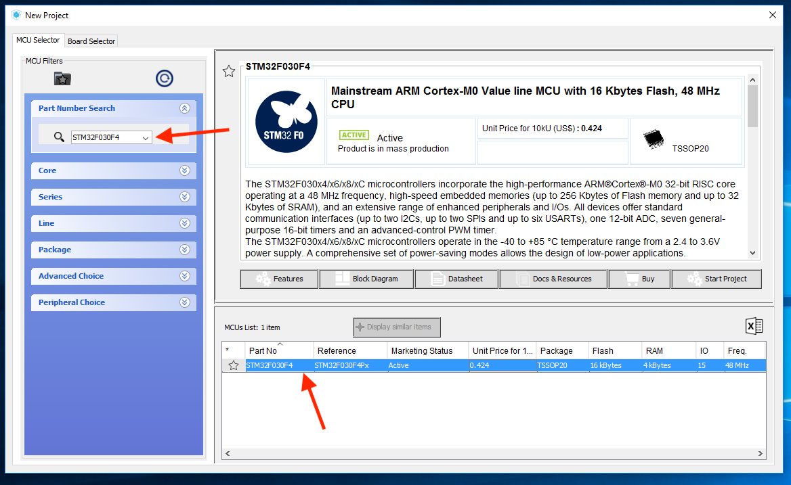

Double click the listing to select this chip:

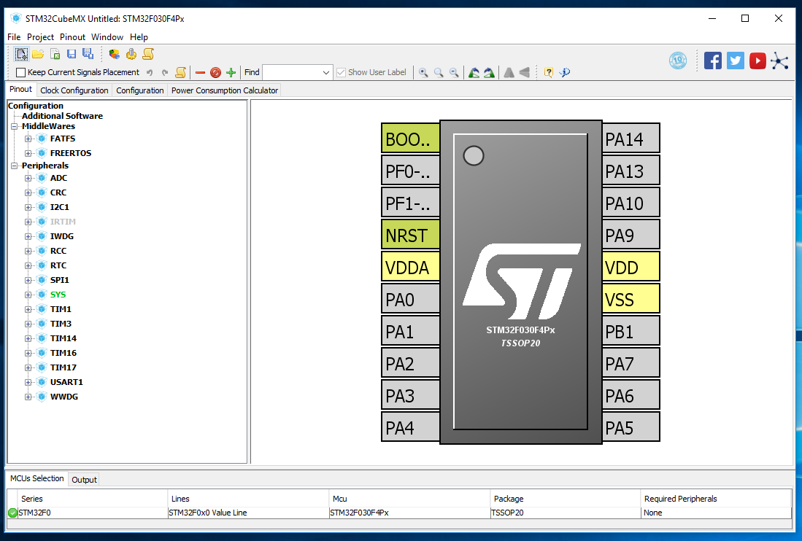

Now we're in a nice chip configuration view! On the left side is a list of available peripherals, and on the right side is a illustration of the chip itself. You can zoom in/out using mouse wheel, move it around with left click, and rotate it with the buttons on the toolbar above to suit your needs.

We do need to configure a few peripherals, so let's begin.

#### Enable SWD

First up we need to enable SWD in order to upload the firmware into the chip. Expand `SYS` node and check the `Debug Serial Wire ` box:

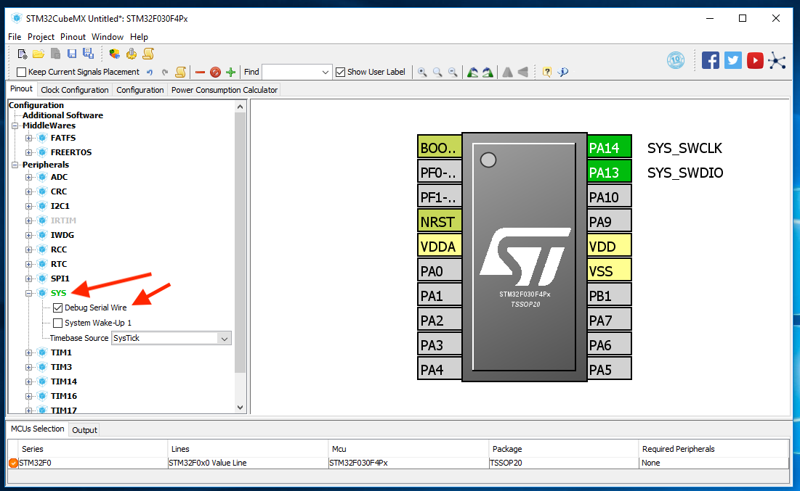

PA14 and PA13 pins are automatically highlighted on the right side, indicating they are being used.

#### Enable External Clock Source

There is an external crystal oscillator on the dev board, and we're going to use that to run the chip. 

Expand RCC (Reset and Clock Control) node, select `Crystal/Ceramic Resonator` for HSE.

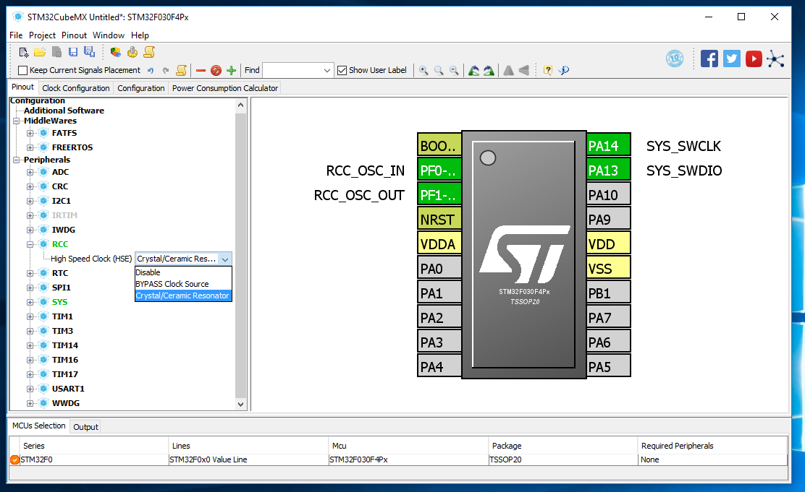

#### Enable GPIO Output

Finally we need to set a GPIO pin to output. We're going to use the LED that's connected to PA4 on our dev board.

***Left*** click on PA4 then select `GPIO_Output`:

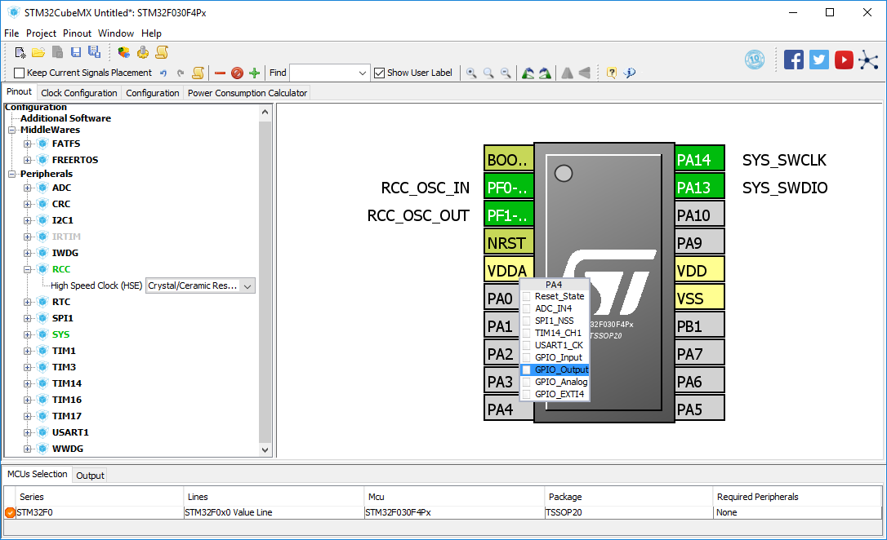

This sets the function of PA4 to GPIO Output, after that ***right*** click on PA4 again and select `Enter User Label` to give it a fancy name, I'm calling it `USER_LED`.

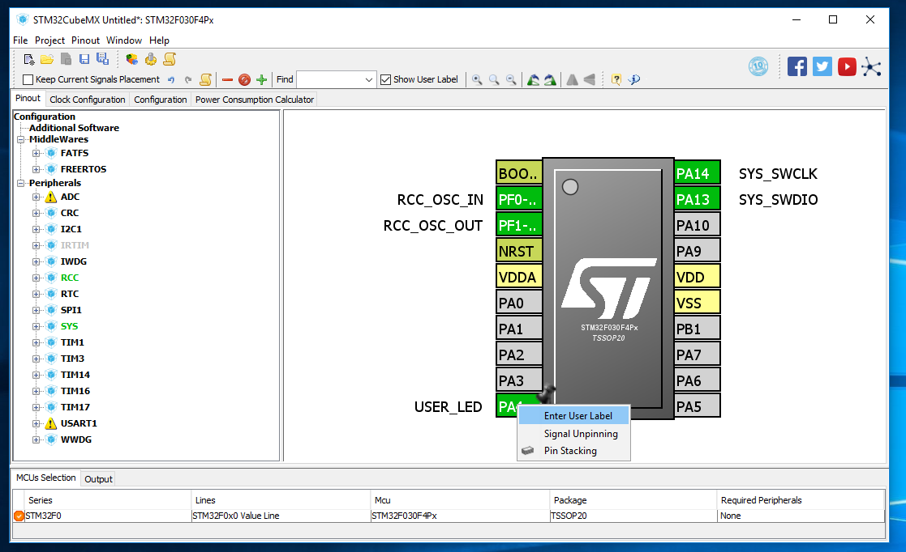

That's all for peripherals! We now have some heady stuff coming up.

#### A Brief Intro on STM32 Clock Signals

Before the next step, I think it would be a good idea to first get you familiar with various clock signals that STM32 utilizes, so here it goes:

##### Internal Clocks

Those clock sources are inside the chips themselves, they are always available, but generally less accurate. Members are:

| Clock | Frequency | Description                                                                                                 |
|-------|-----------|-------------------------------------------------------------------------------------------------------------|
| LSI   | ~40KHz    | Low Speed Internal. Highly unstable, avoid.|
| HSI   | 8MHz      | High Speed Internal. Can be used for system clock.                                                           |
| HSI14 | 14MHz     | Used for ADC.                                                                                                |
| HSI48 | 48MHz     | Only on USB capable chips. Can be used for system clock.                                                                               |

LSI is uncalibrated and inaccurate, avoid at all cost.

HSI and HSI48 work fine if no precise timekeeping is required, otherwise an external crystal is recommended.

##### External Clocks

You can also supply 2 clock signals externally for more accuracy:

| Clock | Frequency         | Description                                |
|-------|-------------------|--------------------------------------------|
| LSE   | Usually 32.768KHz | Low Speed External. Used for RTC timekeeping.   |
| HSE   | 4 - 32MHz         | High Speed External. Used for system clock |

A crystal oscillator is usually utilized for external clocks, as is the case with the dev board we're using.

#### Configuring the Clock Tree

We're ready for the clock tree! Click `Clock Configuration` tab:

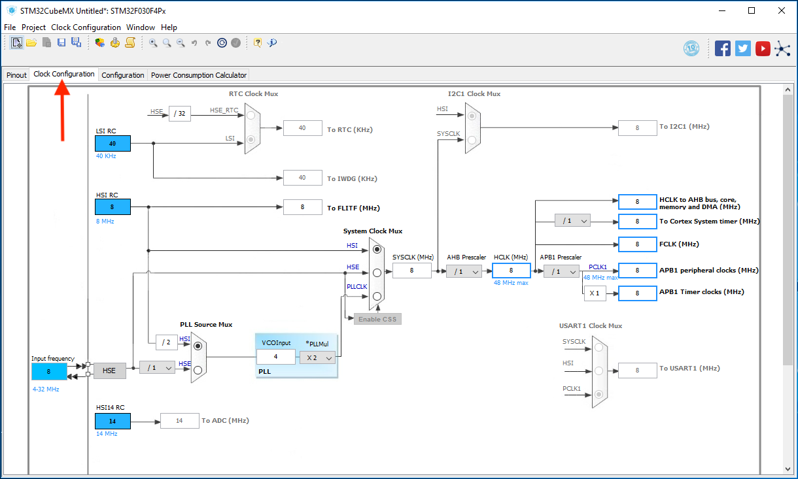

Now this is some proper heady stuff. Don't worry though, I provided a completed set-up below. Follow the yellow path and I'll explain along the way:

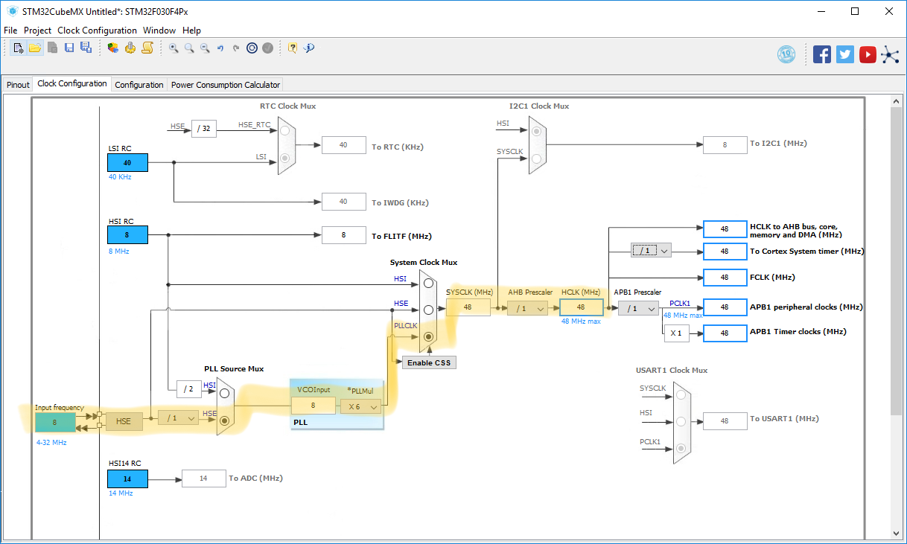

The max clock rate for STM32F0 is 48MHz, so we aim to run a 48MHz system clock. However the crystal on our board is only 8MHz, so we need a way to multiply it up to 48MHz. We use the build-in PLL(Phase Locked Loop) to do exactly that, and the multiplied clock is then used as the system clock. 

We start from the very beginning of the yellow path.


We can see HSE is available since we enabled it earlier. The `input frequency` is set to 8MHz, you can change it if you're using a different crystal.


Next we encounter a clock divider. 8MHz is already pretty slow so we leave it at 1.


Next we run into the `PLL source Mux`, which chooses which clock goes into the PLL, in this case the HSE.


Here inside PLL we choose how many times to multiply the input clock. We have 8MHz and want 48MHz, so 6 it is.

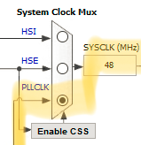

Now we arrive at `System Clock Mux`, which determines what to use to clock the entire system. In this case we pick the 48MHz PLL output.


Now the system clock is 48MHz, and is being distributed to a number of system buses and peripherals. There's no need to worry about the details here, just keep everything under the max frequency and it'll be fine.

That's pretty much it! I hope it made sense. The clock tree might be more complicated on higher end STM32 chips, but the basic principle still stands.

As an exercise, try figure out how to use the HSI for a 48MHz system clock. [Click here](resources/cubehsi.png) to see the answer.

#### Peripheral Configurations

We're almost there! Click the "Configuration" tab for the, well, configuration view. Here you can adjust the settings of all peripherals that you enabled on the first page. Since we only enabled a GPIO, click the `GPIO` button.

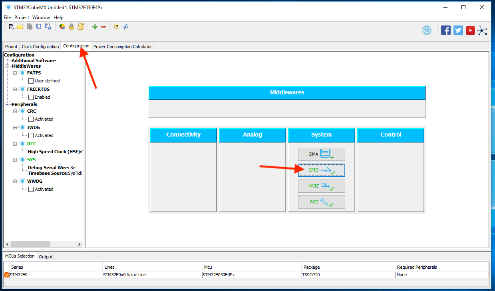

One the new window, select a pin to change its setting.

There actually isn't much to change in this case, but it would help to get familiar with the options:

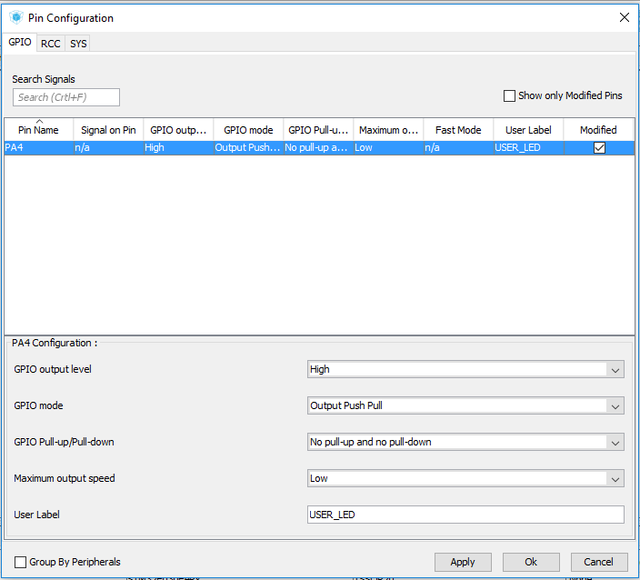

GPIO Output level: High or Low. The initial output level of the pin.

GPIO Mode: Push-Pull or Open-Drain. In short PP can drive a signal both high and low, while OD can only pull the signal low. Read more [here](https://learn.adafruit.com/adafruit-1-wire-gpio-breakout-ds2413/open-drain-gpio) and [here](https://en.wikipedia.org/wiki/Open_collector).

Pull-up/Pull-down: [Read about it here](https://learn.sparkfun.com/tutorials/pull-up-resistors), for output we don't use any pulls at all.

Maximum output speed: Sets the slew rate of output signal. Leave it to default setting.

Click OK to go back, that was all the configuration done, we can finally generate our code now!

#### Generating the code

Now we'll have the STM32CubeMX generate all the initialization code so we don't have to write any.

To begin click `Project` menu then `Settings`:

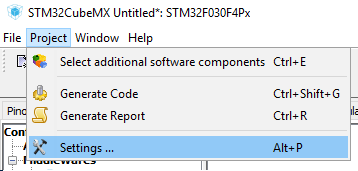

Enter a project name and select its location, select `MDK-ARM V5` as our IDE, don't touch anything else:

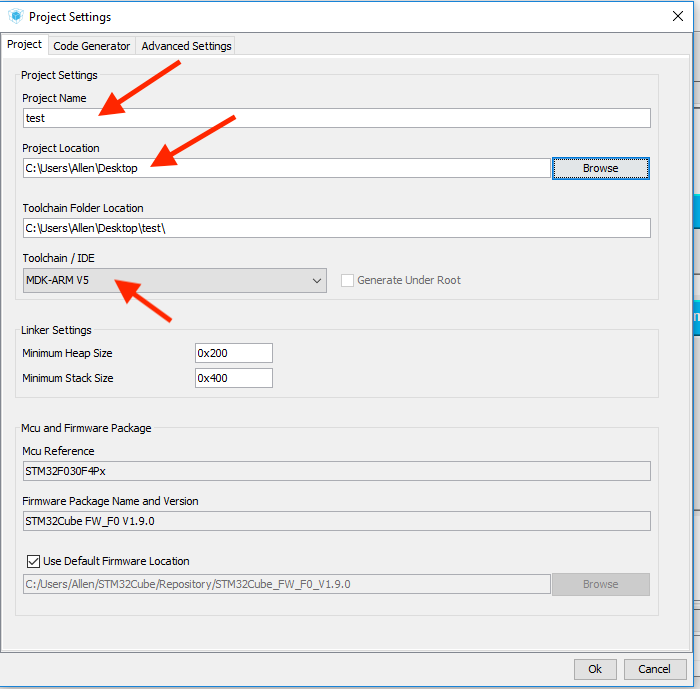

Go to `Code Generator` tab, and select `Copy only the necessary library files`. It's not strictly necessary but I like to keep it clean.

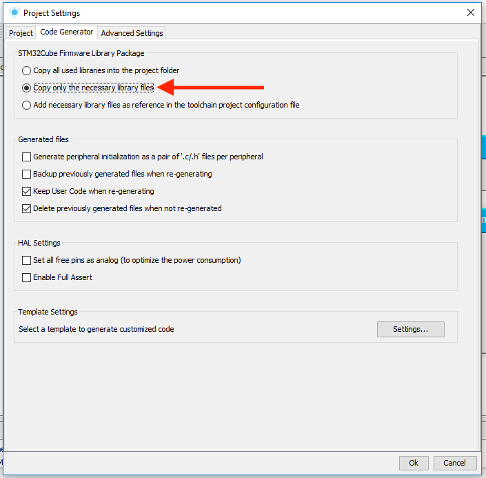

Click OK. If it's the first time running, it will ask you to download a firmware package, confirm and wait for it to finish.

After all that we finally get to generate the code! Click `Generate Code` under `Project` menu:


Hooray!


You can find the generated code in the folder you selected. The `.ioc` file is the STM32CubeMX project you've been working on, and the MDK project is inside `MDK-ARM` folder.

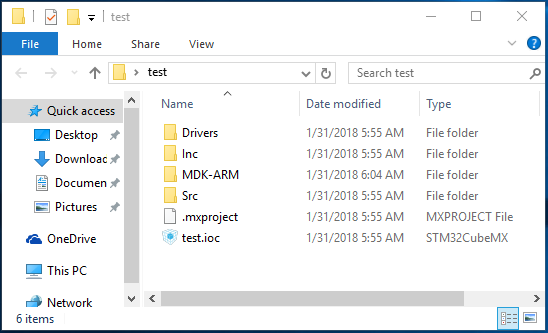

Anyway, click `Open Project` to launch the Keil IDE.


### (Finally) My First STM32 Program

[Go through this guide](mdk_first_time_setup.md) if this is the very first time Keil MDK is running.

After everything's set up, find and open `main.c` by expanding the folders and double clicking on the file:

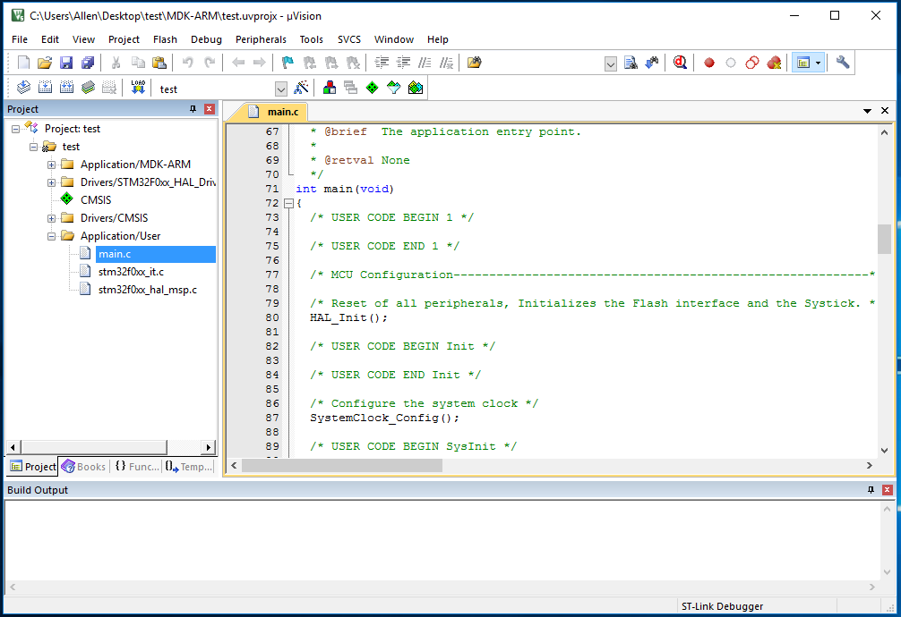

Skim through the code, you'll find the code generator left tons of comment blocks. As a rule:

### ALWAYS PUT YOUR CODE BETWEEN `/* USER CODE BEGIN */` AND `/* USER CODE END */` 

This way when you regenerate the code after making changes in STM32CubeMX, your own code will be preserved, while everything outside will be overwritten. Let's take a look at the `main()` function.

```
int main(void)
{
  /* USER CODE BEGIN 1 */

  /* USER CODE END 1 */

  /* MCU Configuration----------------------------------------------------------*/

  /* Reset of all peripherals, Initializes the Flash interface and the Systick. */
  HAL_Init();

  /* USER CODE BEGIN Init */

  /* USER CODE END Init */

  /* Configure the system clock */
  SystemClock_Config();

  /* USER CODE BEGIN SysInit */

  /* USER CODE END SysInit */

  /* Initialize all configured peripherals */
  MX_GPIO_Init();
  /* USER CODE BEGIN 2 */

  /* USER CODE END 2 */

  /* Infinite loop */
  /* USER CODE BEGIN WHILE */
  while (1)
  {

  /* USER CODE END WHILE */

  /* USER CODE BEGIN 3 */
  }

  /* USER CODE END 3 */
}
```

It looks pretty long but mostly just comments. The generated code first does some initialization, then go into a loop doing nothing, as is comparable to the `setup()` and `loop()` function in Arduino. Anyway, It's up to us to write the actual program, in this case Blinking the LED on PA4.

Right away we have a problem: Arduino has `digitalWrite()`, what do we use here? To answer this question we first need to get to know the library that we're using.

#### The STM32 HAL Libraries

STM32 HAL(Hardware Abstraction Layer) library is a open source library written by ST and recommended for all new projects, and is what STM32CubeMX generates. It provides a complete set of APIs that stay consistent throughout the STM32 lines. This simplifies the coding and improves portability.

All the driver files are in `project_folder/Drivers/STM32F0xx_HAL_Driver`. Each peripheral has their own `.c` and `.h` files. The trick here then is simple:

### To see what you can do with a peripheral, just look at what functions are available in the corresponding HAL driver files

Usually the `.h` file is enough, although there are detailed documentation in the `.c` file too, so try not miss that.

### Also you can right click on any function name and select "Go to definition" to see its details

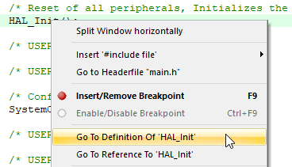


Take GPIO in this case for example. First let's take a look at [stm32f0xx_hal_gpio.h](sample_code/Drivers/STM32F0xx_HAL_Driver/Inc/stm32f0xx_hal_gpio.h). After scrolling down a bit we see:


The first 3 looks promising. To see how to use it we look at the details in the corresponding [stm32f0xx_hal_gpio.c](sample_code/Drivers/STM32F0xx_HAL_Driver/Src/stm32f0xx_hal_gpio.c), there is a general description at the beginning, and you can also search a particular function for its usage.

For `HAL_GPIO_WritePin()`, we have:

```
/**
  * @brief  Set or clear the selected data port bit.
  * @note   This function uses GPIOx_BSRR and GPIOx_BRR registers to allow atomic read/modify
  *         accesses. In this way, there is no risk of an IRQ occurring between
  *         the read and the modify access.
  *
  * @param  GPIOx where x can be (A..H) to select the GPIO peripheral for STM32F0 family
  * @param  GPIO_Pin specifies the port bit to be written.
  *          This parameter can be one of GPIO_PIN_x where x can be (0..15).
  * @param  PinState specifies the value to be written to the selected bit.
  *          This parameter can be one of the GPIO_PinState enum values:
  *            @arg GPIO_PIN_RESET: to clear the port pin
  *            @arg GPIO_PIN_SET: to set the port pin
  * @retval None
  */

void HAL_GPIO_WritePin(GPIO_TypeDef* GPIOx, uint16_t GPIO_Pin, GPIO_PinState PinState)
...

```

As a result, if we want PA4 to output HIGH (3.3V), we call:

`HAL_GPIO_WritePin(GPIOA, GPIO_PIN_4, GPIO_PIN_SET);`

And for LOW (0V), we call:

`HAL_GPIO_WritePin(GPIOA, GPIO_PIN_4, GPIO_PIN_RESET);`

That wasn't too bad was it? And don't forget you can use this method to find out about other peripherals too.

Now we have the GPIO sorted out, we need a delay function. Every STM32 has a SysTick timer soley for timekeeping, and is usually configured to increment every 1ms. The timing functions are in [stm32f0xx_hal.h](sample_code/Drivers/STM32F0xx_HAL_Driver/Inc/stm32f0xx_hal.h) and [stm32f0xx_hal.c](sample_code/Drivers/STM32F0xx_HAL_Driver/Src/stm32f0xx_hal.c). There are quite a lot of code in those two files though, so I'll just put them here:

For delay you'll want to call `HAL_Delay()`. This is equivalent to the `delay()` function in Arduino, and similarly the argument is in milliseconds.

You can also call `HAL_GetTick()` to get how long in milliseconds the chip has been running. This is equivalent to the `millis()` function in Arduino.

That's all we need for the Blink! In the end we have:

```
HAL_GPIO_WritePin(GPIOA, GPIO_PIN_4, GPIO_PIN_SET);
HAL_Delay(200);
HAL_GPIO_WritePin(GPIOA, GPIO_PIN_4, GPIO_PIN_RESET);
HAL_Delay(200);
```

The code sets PA4 to HIGH for 200ms, then sets it to LOW for 200ms. When run in a loop it blinks the LED on PA4.

Now we just have to put it in the loop in `main()` inside `main.c`:

```
int main(void)
{
  /* USER CODE BEGIN 1 */

  /* USER CODE END 1 */

  /* MCU Configuration----------------------------------------------------------*/

  /* Reset of all peripherals, Initializes the Flash interface and the Systick. */
  HAL_Init();

  /* USER CODE BEGIN Init */

  /* USER CODE END Init */

  /* Configure the system clock */
  SystemClock_Config();

  /* USER CODE BEGIN SysInit */

  /* USER CODE END SysInit */

  /* Initialize all configured peripherals */
  MX_GPIO_Init();
  /* USER CODE BEGIN 2 */

  /* USER CODE END 2 */

  /* Infinite loop */
  /* USER CODE BEGIN WHILE */
  while (1)
  {

  /* USER CODE END WHILE */

  /* USER CODE BEGIN 3 */
    HAL_GPIO_WritePin(GPIOA, GPIO_PIN_4, GPIO_PIN_SET);
    HAL_Delay(200);
    HAL_GPIO_WritePin(GPIOA, GPIO_PIN_4, GPIO_PIN_RESET);
    HAL_Delay(200);
  }
  /* USER CODE END 3 */

}

```

I put it between `/* USER CODE BEGIN 3 */` and `/* USER CODE END 3 */`, you can put it just before `/* USER CODE END WHILE */` too. Just make sure it's in the right place and inside the `/* USER CODE */` blocks. [Click here](sample_code/Src/main.c) to see the finished file.

All that's left is to compile and upload the program. Press `F7` to start compiling, it might take a while for the first time, eventually it will finish:


It tells you the memory usage, you can [read the details here](https://stackoverflow.com/questions/5430284/rom-and-ram-in-arm), but in short, `ROM usage = code + RO + RW`, `RAM usage = RW + ZI`. Remember we have 16KB of ROM and 4KB of RAM on this chip.

Press `F8` to start uploading the program into the STM32 chip, should take only a few seconds:


The program should start running right away, if not try pressing the reset button. Anyway, the result: 

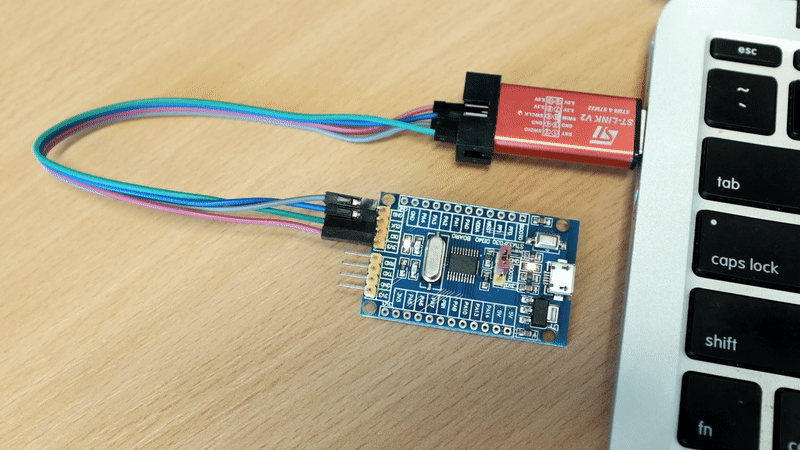

Congratulations! This has been a long journey but you've finally made it, welcome to the world of 32-bit ARM embedded systems!

Getting started was the hardest part, now that you've done it, things are only going to get easier. We'll cover a few other essentials in the upcoming lessons, but for now go spend a moment to bask in the magnificent radiance of a blinking light on a $1.5 circuit board.

## SAVE SAVE SAVE

Don't forget to save your project, but most importantly, always use the `Save All` button. This saves all the project settings we changed in addition to files.


## Extra Tips

Remember we named our PA4 pin `USER_LED` in the STM32CubeMX? You might think I forgot about it, but fear not! [Take a look at main.h](sample_code/Inc/main.h), and you'll find it generated some custom defines:

```
#define USER_LED_Pin GPIO_PIN_4
#define USER_LED_GPIO_Port GPIOA
```

As a result, instead of:

`HAL_GPIO_WritePin(GPIOA, GPIO_PIN_4, GPIO_PIN_SET);`

You can write:

`HAL_GPIO_WritePin(USER_LED_GPIO_Port, USER_LED_Pin, GPIO_PIN_SET);`

The result will be the same but the intention is more clear. 

You'll find all your custom names in `main.h`, try using them to make the code more readable.

## Homework

Here's an exercise for you: Instead of using `HAL_GPIO_WritePin()`, try using the `HAL_GPIO_TogglePin()` to make the light blink.

Read about its usage in [stm32f0xx_hal_gpio.c](sample_code/Drivers/STM32F0xx_HAL_Driver/Src/stm32f0xx_hal_gpio.c) and see what you can do with it.

[Click me to see the answer](homework_answer.md).

## The Free MDK License

I mentioned before that Keil MDK has a 32KB code size limit unless you pay for a license, and ST provides a free license for all F0 and L0 parts. Obviously the chip we're using only has 16KB of flash, so you don't have to do anything, but if you do start using larger chips, [follow this official guide](http://www2.keil.com/stmicroelectronics-stm32/mdk) to activate your MDK for free. Only follow the `Activation` section since we have already done everything else.

## STM32CubeMX Updates

Sometimes STM32CubeMX will update itself, and you need to run it in Administrator mode to finish the process. To do so right-click the icon and select `Run as Administrator` from the context menu.

## Next Steps

Now that we have everything set up, the subsequent lessons will be a significantly shorter than this one.

Next up we'll take a look at setting up UART and print "Hello World" over serial. 

[CLICK ME TO GO TO NEXT LESSON](../lesson1_serial_helloworld/README.md)
