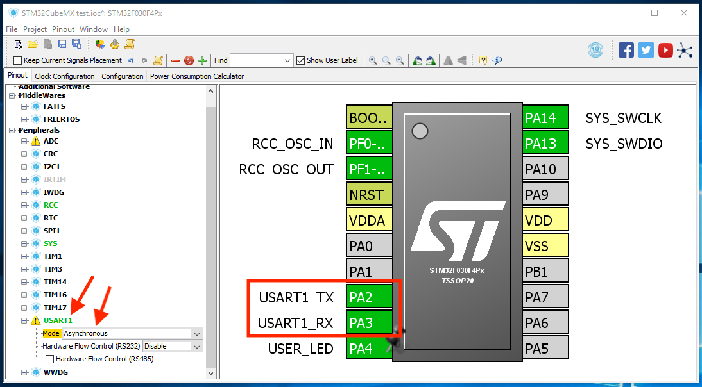

# Lesson 1: UART and Hello World

Previous lesson: [A Complete Walkthrough of Board Detail, Software Setup, and Blinking LED](../lesson0_intro_blinkLED/README.md)

In this lesson we'll get UART transmit working, then set up `printf()` to print our `hello world` over serial.

I don't think I need to elaborate on how important UARTs are in embedded systems, so let's get right to it!

## Headers

For this and subsequent lessons you do need to solder on the headers that came with the board, so that we can connect external components to it. It's a pretty easy job, and if you don't have the tools, try your local hackerspace or universities.

## UART setup in STM32CubeMX

We will be reusing the entire project from the last lesson, so just make a new copy of the project folder. After that, double click and open the `.ioc` file.

Which will take you back to the pin view page:

This time we expand `USART1` and select `Asynchronous` mode. Two more pins are now in use. `PA2` is TX, while `PA3` is RX.

Next we go to the configuration page. Click the newly appeared button to adjust a few settings.

The only thing we actually need to change is the baud rate, you can set it to whatever you want but I like 115200bps.

While you're here take a look at the `Advanced Features`, so many options! It even has TX/RX pin swapping for when you forget to cross the wires! What a world we're living in.

That's it for the CubeMX! Make sure the Keil MDK is closed, and regenerate the code: 

The best practice to **keep Keil MDK closed while regenerating the code in STM32CubeMX**, this keep things consistent and less likely to corrupt the project files.

## Printing "Hello World"

Now we're ready to code our "Hello World" program. Remember what to do when encountering a new peripheral? Yep, we go and see what functions we can use in the HAL library files.

Looking at the `stm32f0xx_hal_uart.h` file, we find
