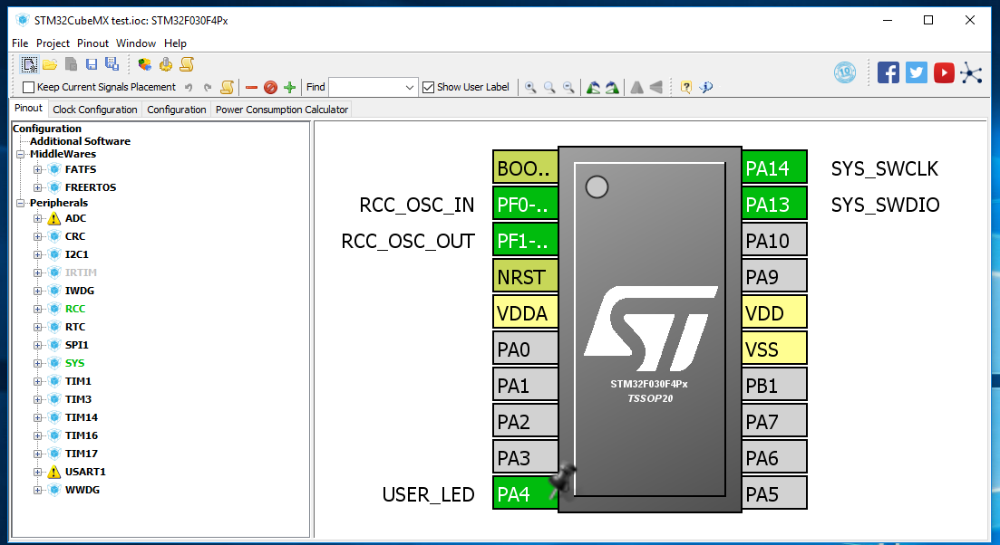
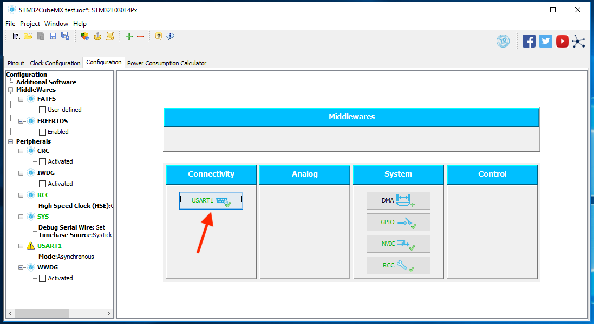
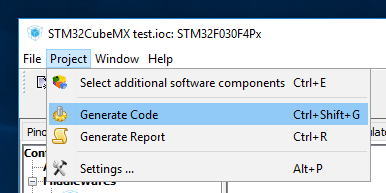

# Lesson 1: UART and Hello World

Previous lesson: [A Complete Walkthrough of Board Detail, Software Setup, and Blinking LED](../lesson0_intro_blinkLED/README.md)

In this lesson we'll get UART transmit working, then set up `printf()` to print our `hello world` over serial.

I don't think I need to elaborate on how important UARTs are in embedded systems, so let's get right to it!

## UART setup in STM32CubeMX

We will be reusing the entire project from the last lesson, so just make a new copy of the project folder. After that, double click and open the `.ioc` file.


Which will take you back to the pin view page:



This time we expand `USART1` and select `Asynchronous` mode. Two more pins are now in use. `PA2` is TX, while `PA3` is RX.


Normally that would be enough. However, the UART header on our board is actually connected to PA9/PA10 instead of PA2/PA3. **[Follow this short guide](alt_locations.md) to switch them around.**

Next we go to the configuration page. Click the newly appeared button to adjust a few settings.



Only thing actually needs changing is the baud rate, 115200bps in this case.

While you're here take a look at the `Advanced Features`, so many options! It even has TX/RX pin swapping for when you forget to cross the wires! What a world we're living in.


That's it for the CubeMX! Make sure the Keil MDK is closed, and regenerate the code: 



The best practice to **keep Keil MDK closed while regenerating the code in STM32CubeMX**, this keep things consistent and less likely to corrupt the project files. After it's done, click `Open Project` button to launch Keil MDK.


## Printing "Hello World"

Now we're ready to code our "Hello World" program. Remember what to do when encountering a new peripheral? Yep, we go and see what functions we can use in the HAL library files.

Looking at the [stm32f0xx_hal_uart.h](sample_code/Drivers/STM32F0xx_HAL_Driver/Inc/stm32f0xx_hal_uart.h), we find the following functions:

```
/* IO operation functions *****************************************************/
HAL_StatusTypeDef HAL_UART_Transmit(UART_HandleTypeDef *huart, uint8_t *pData, uint16_t Size, uint32_t Timeout);
HAL_StatusTypeDef HAL_UART_Receive(UART_HandleTypeDef *huart, uint8_t *pData, uint16_t Size, uint32_t Timeout);
HAL_StatusTypeDef HAL_UART_Transmit_IT(UART_HandleTypeDef *huart, uint8_t *pData, uint16_t Size);
HAL_StatusTypeDef HAL_UART_Receive_IT(UART_HandleTypeDef *huart, uint8_t *pData, uint16_t Size);
HAL_StatusTypeDef HAL_UART_Transmit_DMA(UART_HandleTypeDef *huart, uint8_t *pData, uint16_t Size);
HAL_StatusTypeDef HAL_UART_Receive_DMA(UART_HandleTypeDef *huart, uint8_t *pData, uint16_t Size);
HAL_StatusTypeDef HAL_UART_DMAPause(UART_HandleTypeDef *huart);
HAL_StatusTypeDef HAL_UART_DMAResume(UART_HandleTypeDef *huart);
HAL_StatusTypeDef HAL_UART_DMAStop(UART_HandleTypeDef *huart);
```

That's a lot of choices ending in `_Transmit` and `_Receive`. However, they are all suffixed with either nothing, or `_IT`, or `_DMA`. **[Take a look at this guide](hal_io_modes.md) to learn about the I/O modes in STM32 HAL.**

We'll be using blocking mode in this lesson, and interrupt mode in the upcoming ones. DMA is an advanced topic and currently not covered in this series.

The blocking mode TX function is simply:

`HAL_UART_Transmit(UART_HandleTypeDef *huart, uint8_t *pData, uint16_t Size, uint32_t Timeout);`

First argument is a pointer to an UART device handle. Device handles are structs that hold configuration information. They appear as you enable peripherals and are always found in `main.c` under `/* Private variables --------------*/`

Second argument is a pointer to an `uint8_t` array that contains the data you want to send.

Third argument is an `uint16_t` number that specifies how many bytes from the above array to send.

Last argument is a timeout in milliseconds. The function will return timeout error if time out is exceeded and operation is still not completed. Don't set it too small, 100ms is plenty in this case.