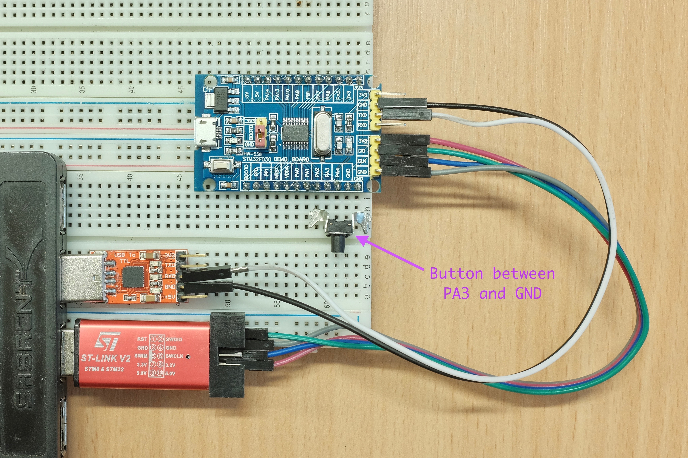
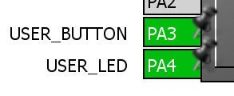
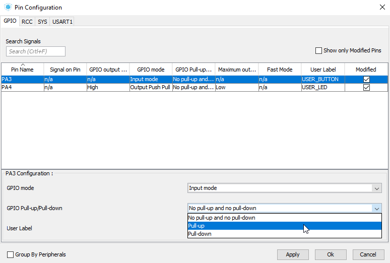
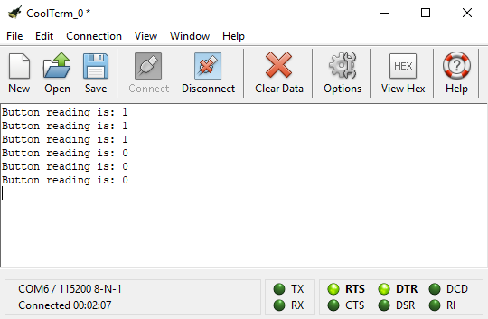

# Lesson 2: External Interrupts

Previous lesson: [UART and Hello World](../lesson1_serial_helloworld/README.md)

In this lesson we'll explore two ways of reading a GPIO pin, polling and external interrupt. As you shall see, polling is the simplest way but interrupt is ultimately more flexible and faster.

## Hookup

For this and subsequent lessons you do need to solder on the headers that came with the board, so we can connect external components to it. It's a pretty easy job, and if you don't have the tools, try your local hackerspace or universities.


After that plug it into breadboards:



Note that I connected a button between PA3 and GND. I picked this pin because of the convenient location, you can use any button on any pin you want. Here is the circuit schematics:


Really couldn't get any simpler! When the button is unpressed, PA3 is not connected to anything. And when pressed, PA3 is connected to ground.

## GPIO Read

Again, we will be reusing the [project from the last lesson](../lesson1_serial_helloworld/sample_code_polling), so **make a new copy of the project folder**. After that, double click and open the STM32CubeMX `test.ioc` file.

This time, we left click on PA3(or whatever pin you're using) and change it to `GPIO_Input`:


Then right click on the same pin and give it a user label:



After that, go to `Configuration` tab and click on `GPIO` button. Select PA3 and enable Pull-up. We do this to prevent the pin floating when the button is not pressed. [Read this](https://learn.sparkfun.com/tutorials/pull-up-resistors) for details.



That's it! Save the project, generate the code, then launch Keil MDK.

Remember the `HAL_GPIO_ReadPin()` we discovered in [lesson 0](../lesson0_intro_blinkLED/README.md#the-stm32-hal-libraries)? It is equivalent to `digitalRead()` in Arduino, and as usual, you can find its detailed usage in [stm32f0xx_hal_gpio.c](sample_code_polling/Drivers/STM32F0xx_HAL_Driver/Src/stm32f0xx_hal_gpio.c). Let's try it out:

```
uint8_t result = HAL_GPIO_ReadPin(USER_BUTTON_GPIO_Port, USER_BUTTON_Pin);
printf("Button Reading is: %d\n", result);
HAL_Delay(500);
```

Put it in the `while` loop in `main()`, compile and upload. You can see the [finished file here](sample_code_polling/Src/main.c).

Launch coolterm, open the port, press the button, and see the result:



When the button is released, the internal pull-up pulls the pin to VCC, so the function reads 1. And when pressed, the pin is connected to GND, so the function returns 0. Easy peasy!

## External Interrupt

