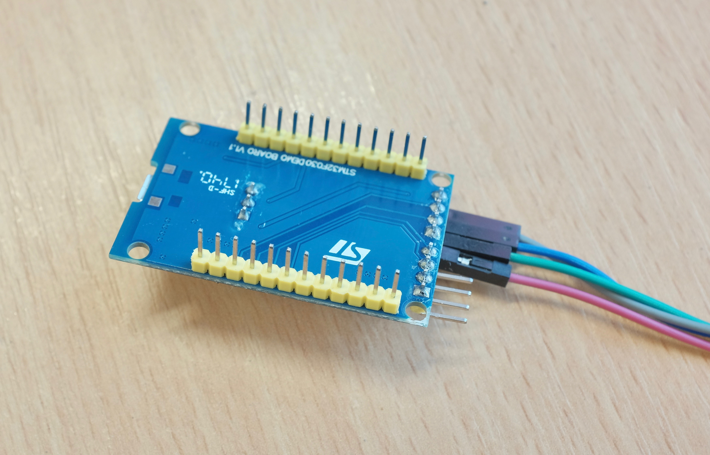
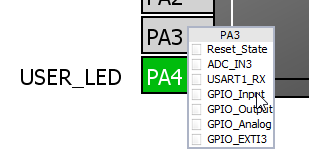
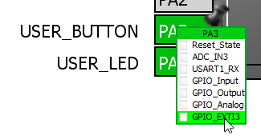
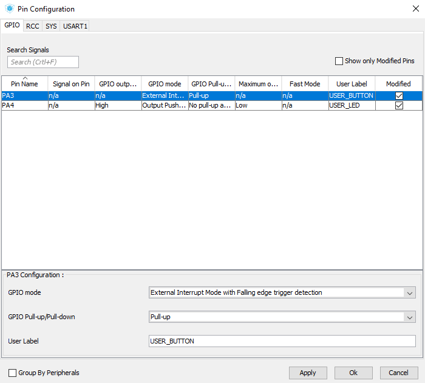
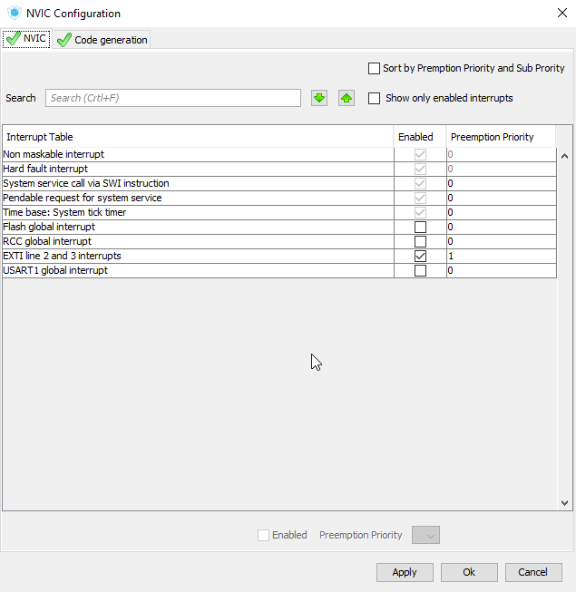
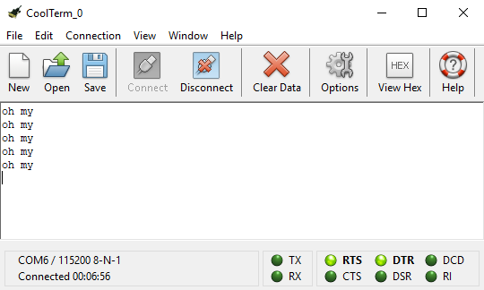

# Lesson 2: STM32 External GPIO Interrupts

[Landing Page: Intro and Required Hardwares](../README.md)

[Lesson 0: Setup and Blinking LED](../lesson0_intro_blinkLED/README.md)

[Lesson 1: UART Transmit](../lesson1_serial_helloworld/README.md)

**`THIS LESSON`** Lesson 2: External GPIO Interrupts

[Lesson 3: UART Receive and External Files](../lesson3_serial_recv_interrupt)

[Lesson 4: Timers, PWM and Watchdog](../lesson4_timers_and_pwm/README.md)

[Lesson 5: SPI and I2C Communication](../lesson5_spi_i2c/README.md)

[Lesson 6: Real-time Operating Systems (RTOS)](../lesson6_rtos/README.md)

[Lesson 255: Movin' On Up](../lesson255_movin'_on_up/README.md)

## Introduction

In this lesson we'll explore two ways of reading a STM32 GPIO pin: polling and external interrupt. As you shall see, polling is the simplest way but interrupt is ultimately more flexible and faster.

## Hookup

For this and subsequent lessons you do need to solder on the headers that came with the board, so we can connect external components to it. It's a pretty easy job, and if you don't have the tools, try your local hackerspace or universities.



After that plug it into breadboards:


Note that I connected a button between PA3 and GND. I picked PA3 because of the convenient location, you can use any button on any pin you want. Here is the circuit schematics:


Really couldn't get any simpler! When the button is unpressed, PA3 is not connected to anything. And when pressed, PA3 is connected to ground.

## GPIO Read

Again, we will be reusing the [project from the last lesson](../lesson1_serial_helloworld/sample_code), so **make a new copy of the project folder**. After that, double click and open the STM32CubeMX `test.ioc` file.

This time, we left click on PA3(or whatever pin you're using) and change it to `GPIO_Input`:



Then right click on the same pin and give it a user label:


After that, go to `Configuration` tab and click on `GPIO` button. Select PA3 and enable Pull-up. We do this to prevent the pin floating when the button is not pressed. [Read this](https://learn.sparkfun.com/tutorials/pull-up-resistors) for details.


That's it! Save the project, generate the code, then launch Keil MDK.

Remember the `HAL_GPIO_ReadPin()` we discovered in [lesson 0](../lesson0_intro_blinkLED/README.md#the-stm32-hal-libraries)? It is equivalent to `digitalRead()` in Arduino, and as usual, you can find its detailed usage in [stm32f0xx_hal_gpio.c](sample_code_polling/Drivers/STM32F0xx_HAL_Driver/Src/stm32f0xx_hal_gpio.c). Let's try it out:

```
uint8_t result = HAL_GPIO_ReadPin(USER_BUTTON_GPIO_Port, USER_BUTTON_Pin);
printf("Button Reading is: %d\n", result);
HAL_Delay(500);
```

Put it in the `while` loop in `main()`, compile and upload. You can see the [finished file here](sample_code_polling/Src/main.c).

Launch CoolTerm, open the port, press the button, and see the result:


The program prints out the reading every half second. When the button is released, the internal pull-up resistor pulls the pin to VCC, so the function reads 1. And when pressed, the pin is connected to GND, so the function returns 0. Easy peasy!

The simple and straightforward `HAL_GPIO_ReadPin()` is sufficient for most situations. However, there is another way of responding to GPIO changes that is faster and more consistent, by using external interrupts.

## External Interrupt

With external interrupts, instead of reading the pin manually at each loop(and wasting CPU time), an ISR(interrupt service routine) is executed when pin state changes. This gives near instant response and does not waste CPU time when idle. This is especially useful when reading short and unpredictable signals like rotary encoders, sound sensors, or laser trip sensors. You can read more about external interrupts on [the Arduino page](https://www.arduino.cc/reference/en/language/functions/external-interrupts/attachinterrupt/).

STM32 has interrupt capability on every pin. The only limitation, at least on STM32F0, is the total number of 16 channels. That means if you're using external interrupt on *multiple pins*, their *pin number* has to be different. Here is a simple illustration:

| Interrupt Pin Combo | Valid? | Remarks                                                |
|---------------------|--------|--------------------------------------------------------|
| PA0 and PA3         | YES    | Pin 0 and 3 are different                              |
| PA0 and PC3         | YES    | Pin 0 and 3 are different (Port number doesn't matter) |
| PA2 and PB2         | NO     | Both pin are 2                                         |

Still, 16 pins is better than Arduino's measly 2 pins, and more than enough for most situations.

We continue working on the project files from the last section, so save a copy if you want. Open up the `test.ioc` file again and left click on PA3 to switch it to `GPIO_EXTI3`. Don't forget to right click and give it a nickname too:



Then go to `Configuration` tab and click on `GPIO` button. Select PA3 and change the GPIO mode to `External Interrupt Mode with Falling edge trigger detection`, and enable the pull-up:



Now we need to **enable** the interrupt, don't forget this step or it won't work! Click on the NVIC(Nested Vectored Interrupt Controller) button:


Check the box of the EXTI interrupt, then set a priority. The *smaller* the number, the *higher* the priority. You typically assign the priority based on the importance of the interrupt.



That's it! Save and regenerate the code.

Now we have external interrupt on PA3 configured and enabled, where do we write the ISR function? As it turns out, HAL has that covered as well.

At the end of [stm32f0xx_hal_gpio.c](sample_code_polling/Drivers/STM32F0xx_HAL_Driver/Src/stm32f0xx_hal_gpio.c), we find:

```
/**
  * @brief  EXTI line detection callback.
  * @param  GPIO_Pin Specifies the port pin connected to corresponding EXTI line.
  * @retval None
  */
__weak void HAL_GPIO_EXTI_Callback(uint16_t GPIO_Pin)
{
  /* Prevent unused argument(s) compilation warning */
  UNUSED(GPIO_Pin);

  /* NOTE: This function should not be modified, when the callback is needed,
            the HAL_GPIO_EXTI_Callback could be implemented in the user file
   */ 
}
```

Note the `__weak` attribute of this function. That means if you define a function with the **same name and arguments** somewhere else, the compiler will use the new one instead. This applies to all `__weak` callback functions in HAL. Again, you just need to look at the peripheral driver file and see what you can use. Those ISR functions also always ends with `Callback`.

Great, let's write our own `HAL_GPIO_EXTI_Callback` then:

```
void HAL_GPIO_EXTI_Callback(uint16_t GPIO_Pin)
{
  printf("oh my\n");
}
```

You can put it anywhere in `main.c`, I like to put it between `/* USER CODE 0 */` block. See the [finished file here](sample_code_extint/Src/main.c). Compile and upload it and observe the output:



Every time the button is pressed, our callback function will execute and print the message. We waste no time polling for this pin in the main loop yet the response is instantaneous.

You might notice it actually prints more than one message per button press, this is an entire different issue of contact bouncing. Read more about [how to debounce a switch](http://coder-tronics.com/switch-debouncing-tutorial-pt1/) here.

And that's it for the basics of external interrupts on STM32!

## Recap

Configure the pin and enable the interrupt in STM32CubeMX, generate code, then write your own callback function. You'll want to keep it short and compact, read more about the [good ISR practices](https://betterembsw.blogspot.co.uk/2013/03/rules-for-using-interrupts.html) here.

## Homework

Try hooking up *another button* to a pin of your choice, and print out *which button* you pressed in the interrupt callback function. Should be like this:

```
Button 1 pressed!
Button 2 pressed!
.....
```

#### Hints

Go back to SMT32CubeMX to add and configure a new pin, regenerate the code. You can also query what pin triggered the interrupt by looking at the `GPIO_Pin` argument in the `HAL_GPIO_EXTI_Callback` function.

#### Answer

[Click me to see the answer](homework_answer). Note the new STM32Cube configuration and revised callback function. The new button is on PA0.

## Next Steps

We'll look at another type of interrupt, this time internal, in the next lesson to implement an efficient UART receiving algorithm.

[CLICK ME TO GO TO NEXT LESSON](../lesson3_serial_recv_interrupt/README.md)

## Questions?

If you have any questions, feel free to [open an issue](https://github.com/dekuNukem/stm32_the_easy_way/issues) or email me at `dekunukem gmail com`. The former is preferable since it helps other people too.
