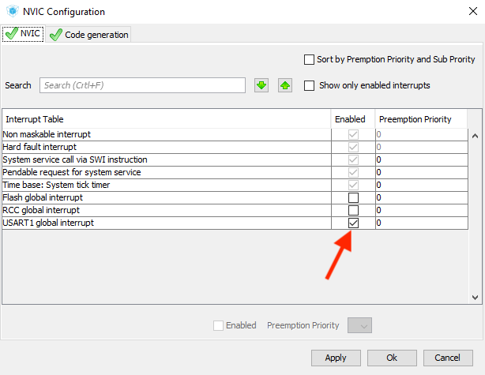

# Lesson 3: Interrupt-based UART receive and including external files

[Landing Page: Required Hardwares](../README.md)

[Lesson 0: Intro and Blinking LED](../lesson0_intro_blinkLED/README.md)

[Lesson 1: UART and Hello World](../lesson1_serial_helloworld/README.md)

[Lesson 2: External Interrupts](../lesson2_external_interrupt/README.md)

Lesson 3: Interrupt-based UART Receive <----- THIS LESSON

## Introduction

In [Lesson 1](../lesson1_serial_helloworld/README.md) we looked at how to print data via UART. While undeniably important, in a lot of applications we need to read from UART as well, which is often the tricky part.

In this lesson we'll look at utilizing internal interrupts to implement an efficient UART receive algorithm. I'm also going to introduce how to include external files to the current project to reduce clutter. This will also give you an idea on how to write your own libraries that you can reuse between different projects.

## Preparation

We'll be expanding upon [Lesson 1](../lesson1_serial_helloworld/README.md), so make a copy of the [project file](../lesson1_serial_helloworld/sample_code) and double check [the hookup](../lesson1_serial_helloworld/README.md#hookup).

Since we'll be using the RX line this time, connect an extra jumper from **`dev board RXD`** to **`serial adapter TXD`**.

## UART Setup

We have already done most of the setups in Lesson 1, there is just one more setting we need to change.

Open the `test.ioc` file and go to the `Configuration` page, click on the NVIC button, and enable the `USART1 global interrupt`



This enables all USART1 interrupts, and we will use a few of them to implement our receive algorithm. Regenerate the code and launch the IDE.

## Reading from UART

As we touched upon in the first lesson, there are [multiple I/O modes](../lesson1_serial_helloworld/hal_io_modes.md) you can use with STM32 peripherals. We used blocking mode `HAL_UART_Transmit()` in that lesson, which is simple and gets the job done.

However the problem of blocking mode becomes apparent when it comes to receiving data. Looking at the `HAL_UART_Receive()`function:

```
HAL_StatusTypeDef HAL_UART_Receive(UART_HandleTypeDef *huart, uint8_t *pData, uint16_t Size, uint32_t Timeout);
```

You specify how many bytes of data you want to receive, and then call it. This function will then block until either it has received the number of bytes, or timeout.

The trouble is that we usually don't know how much data are coming nor when. So if we use blocking I/O for UART receive, a huge amount of CPU time is going to be wasted just waiting for data to arrive, and we can't do anything else in the meantime. This is why interrupt mode makes much more sense in this case.