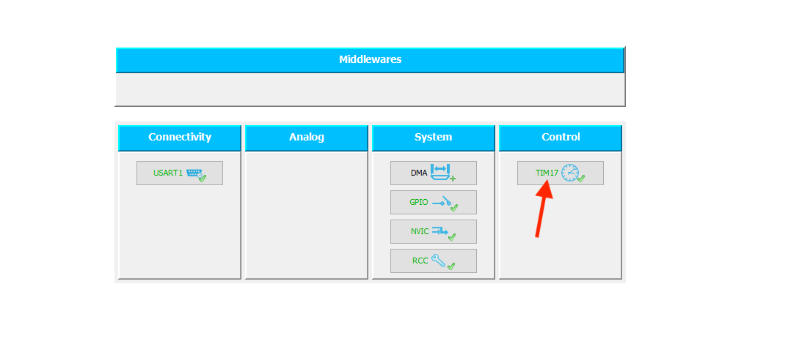
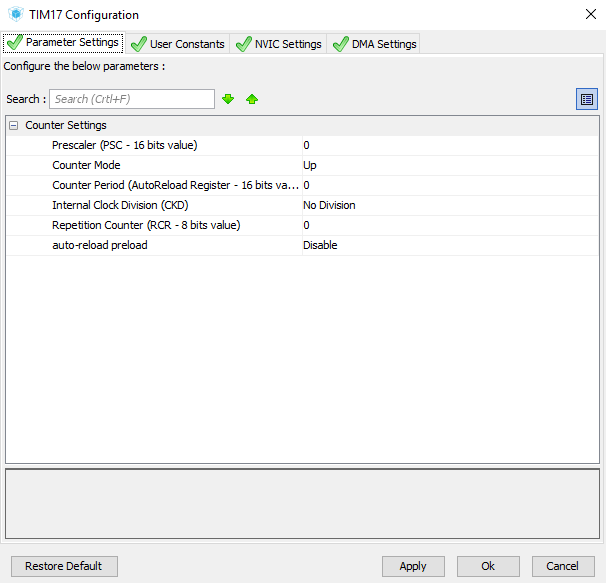
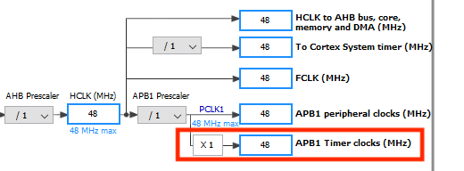
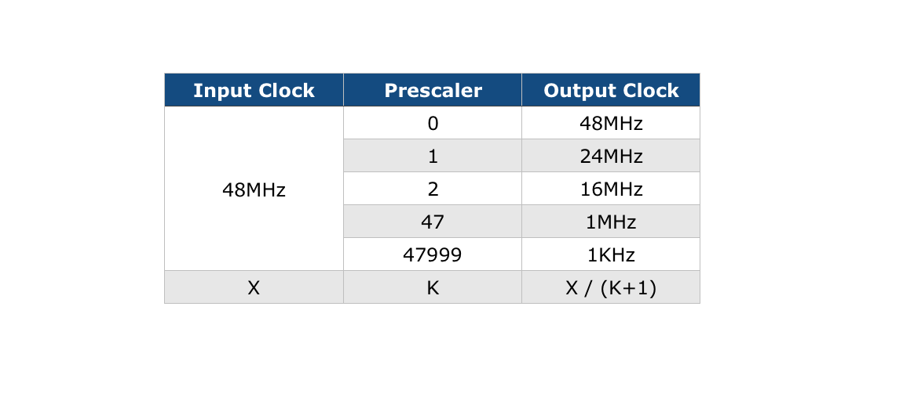

# Lesson 4: Timers and PWM

[Landing Page: Intro and Required Hardwares](../README.md)

[Lesson 0: Setup and Blinking LED](../lesson0_intro_blinkLED/README.md)

[Lesson 1: UART and Hello World](../lesson1_serial_helloworld/README.md)

[Lesson 2: External GPIO Interrupts](../lesson2_external_interrupt/README.md)

[Lesson 3: Receive and External Files](../lesson3_serial_recv_interrupt)

**`THIS LESSON`** Lesson 4: Timers and PWM

## Introduction

Timers are another commonly used peripheral in microcontrollers. They are basically counters with programmable clock inputs. Timers are used to keep track of time, raise periodic interrupts, drive PWM outputs, and many more besides.

In this lesson we'll take a look at two most common use cases: Timer interrupt and PWM output.

We'll also briefly cover the watchdog timer while we're at it.

## STM32 Timers

Each STM32 variant has several built-in timers. They are numbered from TIM1 to TIM20, and grouped into different types:

* `General purpose timers`: As the name suggests, those are the standard timers with functions like output compare, one-pulse, input capture, sensor interface, interrupts, PWM output, and many more.

* `Advanced timers`: Those come with even more bells and whistles, usually highly specialized like motor control and digital power conversion.

* `Basic timers`: Barebone timers with no outputs. Usually used for timekeeping.

* `Other timers`: Specialized chip-specific timers like low-power or high-resolution timers.

Usually the higher-end the chip, the more timer it has. The details of STM32 timers is quite a rabbit hole, but we'll keep it simple for the basic usages in this lesson.

If you want to learn more, [Here is an cross-series overview](resources/timer_overview.pdf) of STM32 timers. There are also helpful information in the [timer section of the datasheet](resources/datasheet.pdf) of chip we're using.

## Preparation

Again, we'll be expanding upon [Lesson 1](../lesson1_serial_helloworld/README.md), so make a copy of the [project file](../lesson1_serial_helloworld/sample_code) and double check [the hookup](../lesson1_serial_helloworld/README.md#hookup).

## Timer Interrupts

Periodic interrupts is one of the most common use case for timers. They are mostly used for timekeeping or performing repetitive tasks. Arduino use it in `millis()` to keep track of milliseconds, video controllers use it to generate frame sync pulses, and operating systems use it for task switching to give the illusion of multitasking.

We're going to implement a simple example of timer interrupt: printing `hello world` every 100 milliseconds.

Open the `test.ioc` file, to the left of the screen we can see the available timers on this chip:

If you bothered to look at [page 18 of the datasheet](resources/datasheet.pdf), you'll find TIM1 is an advanced timer, while the rest are general purpose timers. They all have 16-bit resolution. TIM1 and TIM3 has 4 channels, and the rest has only 1 channel.

In this example I'm going to use TIM17, of course you can use whichever you want in your own project. Anyway, expand it and check the `Activated` box:

This enables timer 17. Now go to the `Configuration` tab, and click the newly appeared `TIM17` button:

Now we need to change some settings to ensure the counter behaves as intended:

There is going to be some math involved, but nothing too heady. Allow me to explain:

### Timer prescaler

As mentioned before, each timer is basically a counter with programmable clock input. At each clock period, the counter increments by 1.

You can find timers' input clock speed on the `Clock Configuration` tab. In this case we see that the `APB1 Timer Clock` is 48MHz, same as system clock:

This means by default, the counter in timers counts up at 48MHz, which is obviously way too fast. Fortunately, we can slow down this clock by dividing it with a custom value. This value is called the *prescaler*.

Timer prescaler in STM32 is an unsigned 16-bit number by which the input clock is divided. The table below illustrates how it works:

As you can see, the input clock is divided by `prescaler + 1`. Not too bad.

### Timer counter period

Another thing to keep in mind is the `counter period`.

The counter in timers will count up from 0 to `counter period` at the clock speed obtained from the `prescaler` we discussed above. Once the counter reaches the `counter period`, it will reset to 0 and start all over again. 

If interrupt is enabled, a `PeriodElapsed` interrupt will be raised when the rollover happens. This is the periodic timer interrupt that we were talking about earlier. 

### Getting the right number

It's easy to see that both `prescaler` and `counter period` affect the frequency of timer interrupts, and we need to calculate those two values based on our requirements.

Generally, you use `prescaler` to get the clock speed in the ballpack, then use `counter period` to fine tune frequency.

As an example, we want our timer interrupt to happen every 100ms. To do this we want a 1KHz counter clock. Dividing input clock frequency by the desired output, we get a ratio of `48000000 / 1000 = 48000`. However since `prescaler` starts at 0, we need to subtract 1 from the ratio. Therefore our final `prescaler` is 47999, and this gives us a 1KHz clock to the timer counter.

Now that we have a counter clock with a period of 1ms, we can set `counter period` to 100. As a result the counter counts up to 100 then resets, generating an interrupt every 100ms.

Here we have a combination of `prescaler = 47999` and `counter_period = 100` for an 10Hz interrupt. However it's easy to see that other combination works too, for example `prescaler = 23999` and `counter_period = 200`, or even `prescaler = 479` and `counter_period = 10000`.

Again, it's up to you to decide what to use. Just keep in mind that neither of them can exceed 65535, and maybe don't make `counter period` too small or you'll lose the ability to fine tune the frequency.

There is also a detailed formula on page 10 of the [timer overview](resources/timer_overview.pdf) if you want more information.

### Try it out