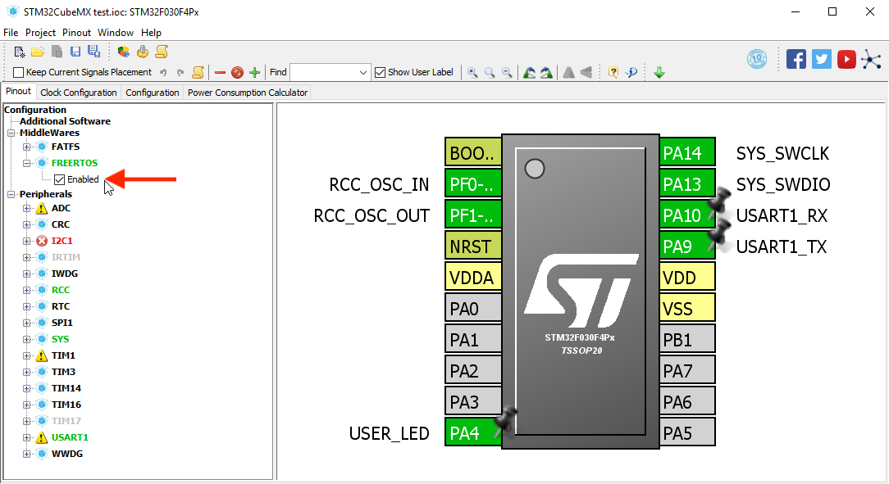
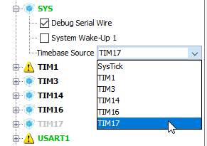
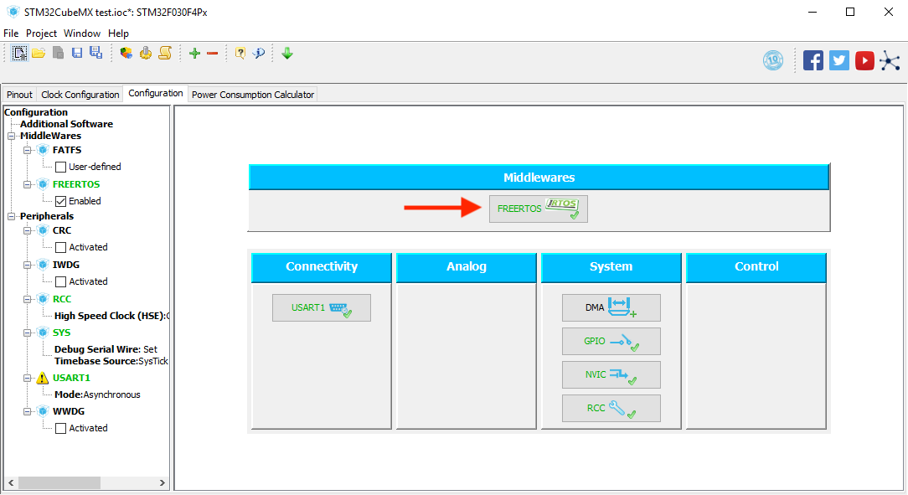
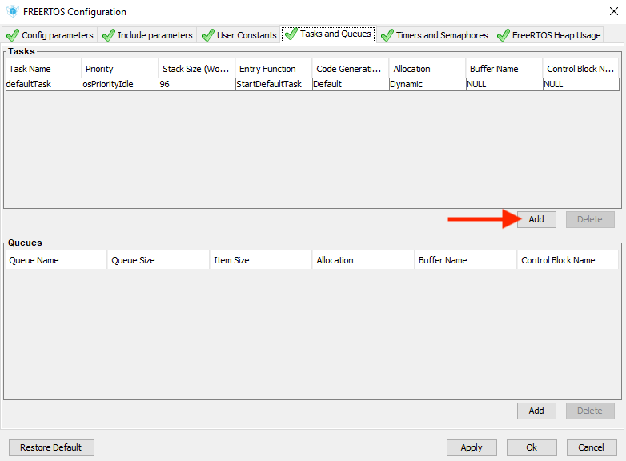
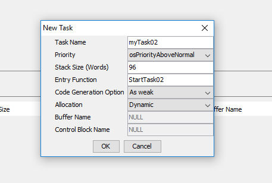
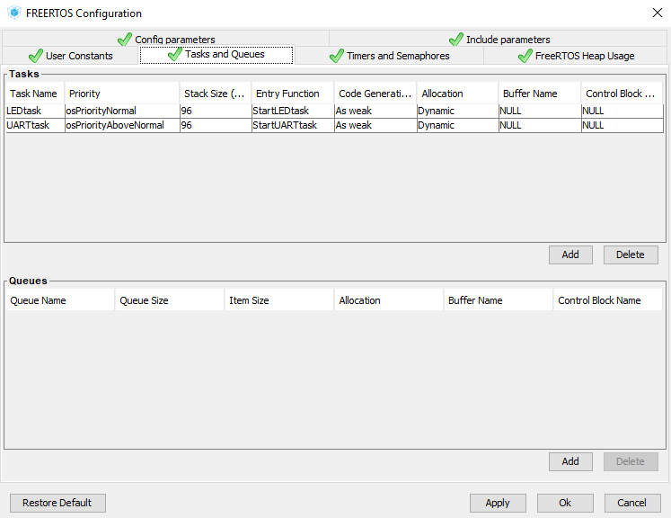
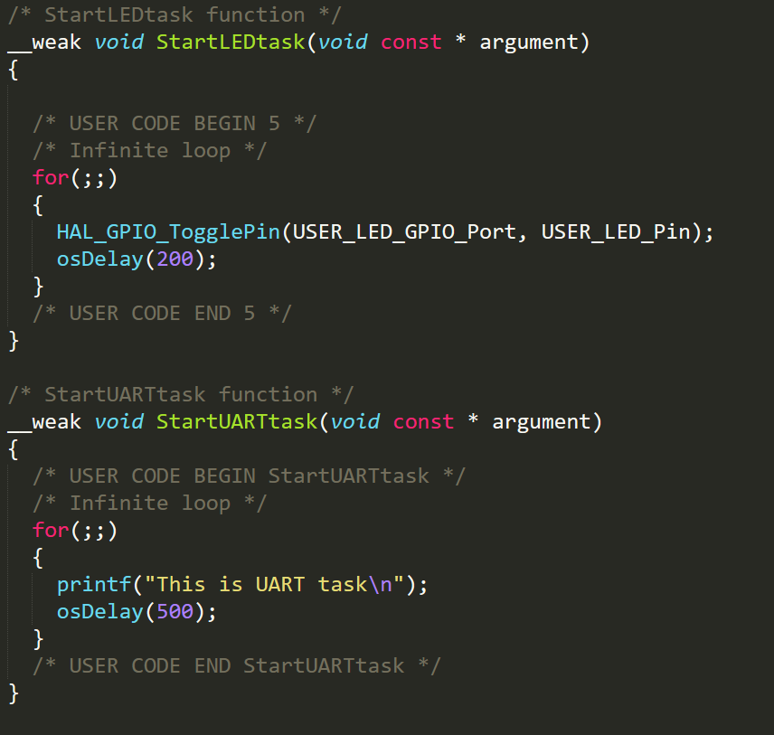
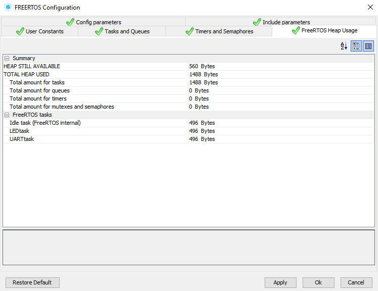
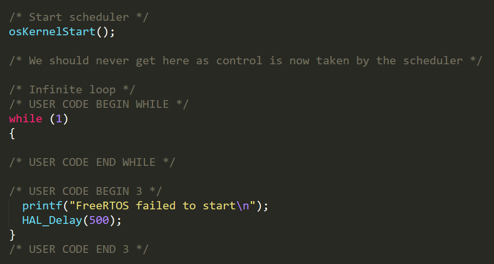

# Lesson 6: UART and Hello World

[Landing Page: Intro and Required Hardwares](../README.md)

[Lesson 0: Setup and Blinking LED](../lesson0_intro_blinkLED/README.md)

[Lesson 1: UART and Hello World](../lesson1_serial_helloworld/README.md)

[Lesson 2: External GPIO Interrupts](../lesson2_external_interrupt/README.md)

[Lesson 3: UART Receive and External Files](../lesson3_serial_recv_interrupt)

[Lesson 4: Timers and PWM](../lesson4_timers_and_pwm/README.md)

[Lesson 5: SPI and I2C Communication](../lesson5_spi_i2c/README.md)

**`THIS LESSON`** Lesson 6: Real-time Operating Systems (RTOS)

## Introduction

So far, we have been writing programs and executing them inside a big `while` loop in `main.c`. This single-threaded approach is simple, straightforward, and more than adequate for a large portion of embedded applications.

However, this becomes inadequate or overly complicated in some situations.  Imagine you're designing a control panel that needs to carry out a number of tasks such as reading key inputs, updating a display, reading sensors, parse incoming data, setting outputs, etc.

Those tasks take different amount of time to complete, and need to be executed at different intervals with different priorities. I guess you can imagine it would be a nightmare to set up in a single-threaded environment, and if one task bogs down or hangs, the entire system crashes.

This is where **Real-time Operating System** comes in. Just like the desktop OS you're using, RTOS allows you to define tasks that **run in parallel**. Thus freeing you from having to manage the timing yourself.

RTOS achieves the illusion of concurrent execution by running each task for a short time then switch to another. By doing this hundreds of times a second, it feels like all the tasks are executing at the same time. The job of determining which task to run (and for how long) and which task to put to sleep is called **task scheduling**.

To witness RTOS in action, we're going to set up the open-source FreeRTOS on our STM32 board and create two tasks in this lesson.

## Recommended Readings

Predictively, the description of RTOS above is extremely simplified and generalized. You can find some introductory guides with slightly more details below:

* [What is RTOS?](https://www.freertos.org/about-RTOS.html)

* (Another one) [What is RTOS?](https://www.highintegritysystems.com/rtos/what-is-an-rtos/)

* [FreeRTOS Tutorial](https://www.freertos.org/tutorial/)

And of course, there's always Wikipedia:

* [Real-time operating system](https://en.wikipedia.org/wiki/Real-time_operating_system)

* [Task (computing)](https://en.wikipedia.org/wiki/Task_(computing))

* [Real-time computing](https://en.wikipedia.org/wiki/Real-time_computing)

## Hookup

Once again, we'll be expanding upon [Lesson 1](../lesson1_serial_helloworld/README.md), so make a copy of the [project file](../lesson1_serial_helloworld/sample_code) and double check [the hookup](../lesson1_serial_helloworld/README.md#hookup).

## FreeRTOS setup in STM32CubeMX

In the `Pinout` page, simply check the `Enabled` box under `FREERTOS`.

For some reason, FreeRTOS doesn't like to use the default `SysTick` timer for internal timekeeping, so we have to select another timer as the time base. If you don't do this, STM32Cube will warn you at code generation, so we might as well do it now.

Expand `SYS`, and change the `Timebase Source` to one of the lesser-used timers:

Click the newly appeared `FREERTOS` button in `Configuration` page:

A huge configuration window appears. Fortunately most of the defaults are already good, although you might want to adjust the `Memory Management settings` to suit your need.

The `TOTAL_HEAP_SIZE` is the total amount of memory that can be used by your tasks. Remember on this chip we only have 4KB RAM, so 2KB for the RTOS is a good choice.

`Memory management scheme` determines how memory can be allocated and freed with `malloc()` and `free()`. [Do read this page for details](https://www.freertos.org/a00111.html), but most of the time `heap_1.c` is enough.

With the RTOS setting finished, we can define some tasks now. Click on the `Tasks and Queues` tab:

We can see there is already a task called `defaultTask`. Let's make another one. Click on the `Add` button:

`Task Name` is pretty self-explanatory.

`Priority` influences how a task is treated by the scheduler. High priority tasks will be able to interrupt lower priority tasks, and have a shorter response time. Generally you give time-critical or safety-critical tasks higher priorities.

`Stack Size` determines the available stack for this task. Too little your task will crash, too much you're wasting memory. I suggest start from the default and turn it up if your task starts to behave erroneously.

`Entry Function` is the name of the actual function for the task that you're going to write your code in, so name it accordingly.

At lastly, I suggest changing `Code Generation Option` to `Weak` so you can write the code for your tasks in external files. 

In this case, I changed the default task name to `LEDtask`, then added another tasked called `UARTtask`:

Note that `UARTtask` has a higher priority than `LEDtask`, so should those two tasks try to execute at the same time, the former will always get to run first.

There are some useful information in other tabs too. For example `FreeRTOS Heap Usage` tab tells you how much memory your tasks are using, and how much left. Feel free to take a look at your own time.

But for now that's all we need. Click `Ok` and generate the code.

## Coding Tasks In FreeRTOS

You will find generated task functions near the end of `main.c`:

Note how instead of putting everything in the big `while` loop in `main()`, each task has its own infinite loop. All you have to do is put your own code in there.

In this very simple case `LEDtask` blinks the LED every 0.2 seconds, and `UARTtask` prints out a message every 0.5 seconds. They will run concurrently, and everything will happen in their own time.

Of course in real world projects things are a bit more complicated. For example you can have a `UIupdateTask` for taking care of the display, and a `sensorUpdateTask` with a higher priority for reading sensors, and so on.

## Common Pitfalls

Of course the convenience of RTOS doesn't mean it has no downsides, and here are a number of common pitfalls you need to be aware of.

### Race Condition and Resource Control

What happens if one task tries to write to an variable while another is reading it at the same time? What about two tasks trying to write to UART at the same time?

Two common way of controlling shared resources is [mutex](https://en.wikipedia.org/wiki/Lock_(computer_science)) and [Semaphore](https://en.wikipedia.org/wiki/Semaphore_(programming)). Both are [Supported by FreeRTOS](https://www.freertos.org/a00113.html).

But of course this topic is an entire field of study in computer science, so if you want to read more about it, there are tons of wikipedia articles to spend time on. Here are a few to get you started: [Race Condition](https://en.wikipedia.org/wiki/Race_condition), [Semaphore](https://en.wikipedia.org/wiki/Semaphore_(programming)), [Critical Section](https://en.wikipedia.org/wiki/Critical_section).

### Memory Issues

If you haven't noticed already, RTOS does need a lot more memory than bare metal programming. Take a look at the `FreeRTOS Heap Usage` tab:

Even with just two simple tasks that barely does anything, we've used 1488 bytes of RAM. As a result, if you're planning to do something actually useful with FreeRTOS, I suggest using a higher-end STM32 chip with more than 8KB of RAM.

Also note the FreeRTOS launch code in `main.c`:

Notice how it mentions you should never get to the `while` loop, since the scheduler takes over when `osKernelStart()` is called? 

If you do end up in the `while` loop, or your task is behaving erratically or not working at all, it's usually because of insufficient memory. Check your total FreeRTOS heap is large enough, and try increasing the stack size for the offending task in STM32Cube. Don't forget to regenerate the code and recompile.

## External Files

More often than not, if you're using RTOS in the first place, your project is already pretty complicated. Right now STM32Cube puts all the task functions in `main.c`, while in reality it's better to put them in separate files.

That's why we selected `As Weak` when generating them. Simply declare the same function in an external file, and the compiler will use the new one instead.

[Here is an example](sample_code_external_files), where I put the task functions inside [my_task.h](sample_code_external_files/Inc/my_tasks.h) and [my_task.c](sample_code_external_files/Src/my_tasks.c).

## Next Steps

with that, we have covered the basics of STM32 development, feel the advantages over arduino, what's next?